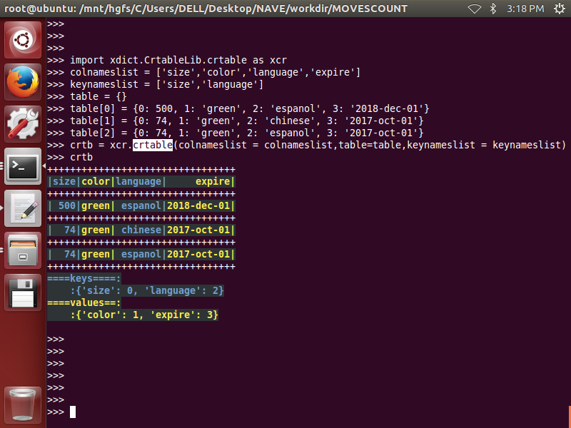

# dlixhict-didactic
>__1. transform and converting between html,json,python-dict,command-line,dir-path__  
__2. dict, list, tuple, toolset__

# install
>__pip3 install xdict__

# INTRODUCE:

for detailed usage and functions please refer to:
-------------------------------------------------

----------------------------------------------------------
>├── [console_color](ReadMeDetailed/console_color.md)      
├── CrtableReadMe  
>>>>├── [crtable](ReadMeDetailed/CrtableReadMe/crtable.md)  

>├── [hdict_cmdline](ReadMeDetailed/hdict_cmdline.md)    
├── [hdict_object](ReadMeDetailed/hdict_object.md)   
├── [hdict_xml](ReadMeDetailed/hdict_xml.md)  
├── [jprint](ReadMeDetailed/jprint.md)  
├── [ltdict](ReadMeDetailed/ltdict.md)  
├── [structure](ReadMeDetailed/structure.md)  
├── TestReadMe  
>>>>├── [genrand](ReadMeDetailed/genrand.md)  

>├── [tuple_list](ReadMeDetailed/tuple_list.md)  
└── [utils](ReadMeDetailed/utils.md)

-------------------------------------------------------

## Part1. [crtable](ReadMeDetailed/CrtableReadMe/crtable.md)
__1. init__  
-----------
		import xdict.CrtableLib.crtable as xcr
		colnameslist = ['size','color','language','expire']
		keynameslist = ['size','language']
		table = {}
		table[0] = {0: 500, 1: 'green', 2: 'espanol', 3: '2018-dec-01'}
		table[1] = {0: 74, 1: 'green', 2: 'chinese', 3: '2017-oct-01'}
		table[2] = {0: 74, 1: 'green', 2: 'espanol', 3: '2017-oct-01'}
		crtb = xcr.crtable(colnameslist = colnameslist,table=table,keynameslist = keynameslist)
		crtb

 

__2. getitem__
--------------  
		from xdict.jprint import pobj
		keys_1 = {'language':'espanol','color':'green'}
		values_1 = crtb[keys_1]
		keys_2 = {'color':'green'}
		values_2 = crtb[keys_2]
		values_1
		pobj(values_1)
		values_2
		pobj(values_2)  

  
  

__3. .select_rownums(keysorvalues)__  
------------------------------------
		crtb
		keysorvalues = {'color':'green'}
		rownums = crtb.select_rownums(keysorvalues)
		rownums
		keysorvalues = {'language':'espanol'}
		rownums = crtb.select_rownums(keysorvalues)
		rownums  

 

__4. .select_attribs(keysorvalues)__
------------------------------------
		crtb
		keysorvalues = {'color':'green'}
		attribs = crtb.select_attribs(keysorvalues)
		pobj(attribs)
		keysorvalues = {'language':'espanol'}
		attribs = crtb.select_attribs(keysorvalues)
		pobj(attribs)  
		
  

  

__5. .select_values(keys)__
---------------------------
		crtb
		keys = {'language':'espanol'}
		values = crtb.select_values(keys)
		pobj(values)
		keys = {'language':'espanol','size':74}
		values = crtb.select_values(keys)
		pobj(values)  
		
  
  

__6. .choose_cols(colslist)__
-----------------------------
		crtb
		colslist = [0,2]
		subcols = crtb.choose_cols(colslist)
		xcr.show_crtable(subcols)
		colslist = ['size','color']
		subcols = crtb.choose_cols(colslist)
		xcr.show_crtable(subcols)  

  
  

__7. .choose_rows(rownumslist)__
--------------------------------
		crtb
		rownumslist = [1,2]
		subrows = crtb.choose_rows(rownumslist)
		xcr.show_crtable(subrows)  
		
 

__8. .append_row(row)__
-----------------------
		crtb
		row = {'size': 700, 'color': 'pink', 'language': 'espanol'}
		crtb.append_row(row)
		crtb

__9. .append_rows(rows)__
-------------------------
		crtb
		rows = [{'size': 555, 'color': 'yellow', 'language': 'chinese'},
		        {'size': 555, 'color': 'yellow', 'language': 'korean'}]
		crtb.append_rows(rows)
		crtb

  

__10. .prepend_row(row)__
-------------------------
		crtb
		row = {'size': 700, 'color': 'pink', 'language': 'espanol'}
		crtb.prepend_row(row)
		crtb

  

__11. .prepend_rows(rows)__
---------------------------
		crtb
		rows = [{'size': 555, 'color': 'yellow', 'language': 'chinese'},
		        {'size': 555, 'color': 'yellow', 'language': 'korean'}]
		crtb.prepend_rows(rows)
		crtb

  

__12. .append_col(col)__
------------------------
		crtb
		col = {'owner':['dli','dli','dli','dli']}
		crtb.append_col(col)
		crtb

  

		
