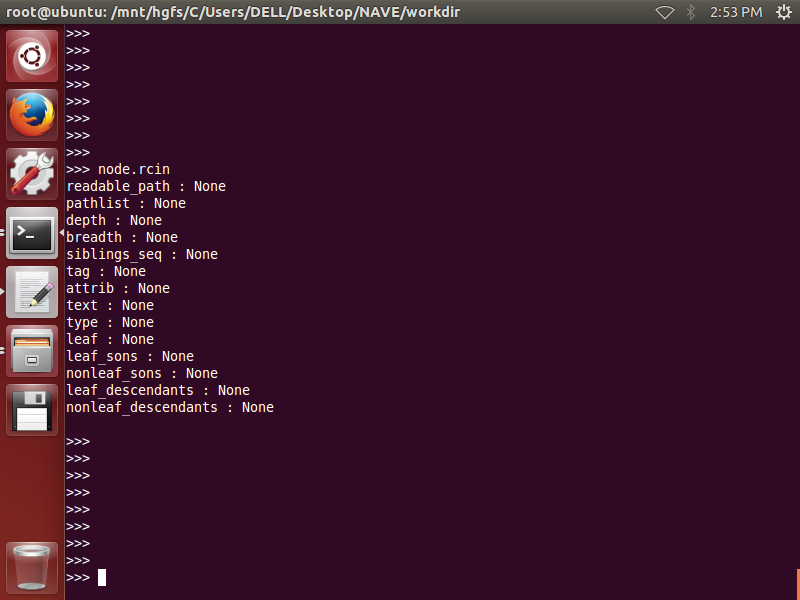
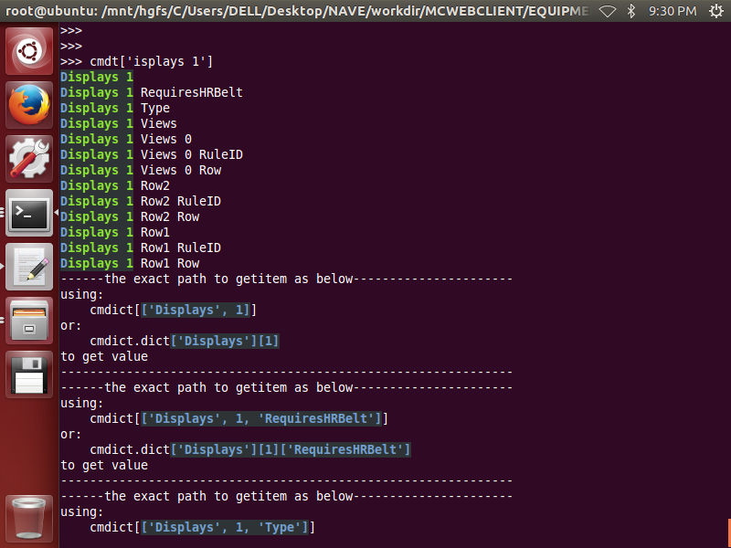
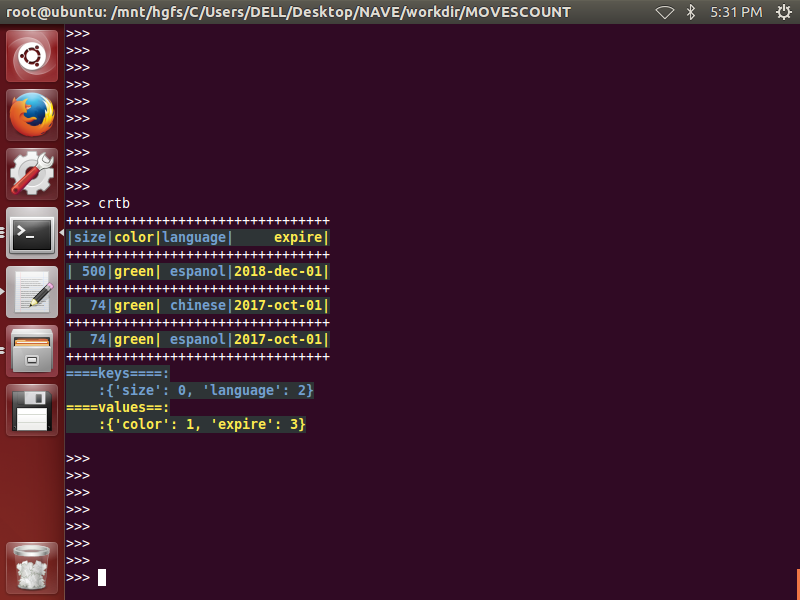

# dlixhict-didactic
>__1. transform and converting between html,json,python-dict,command-line,dir-path__  
__2. dict/list/tuple/set toolsets__

# install
>__pip3 install xdict__

# INTRODUCE:
-------------------------------------------------  

        #QUERY BIG JSON

        #to query big json
        
        @#jsonq nested.json '7 Row'
        Displays 7 Row1
        Displays 7 Row1 Row
        Displays 7 Row1 RuleID
        Displays 7 Row2
        Displays 7 Row2 Row
        Displays 7 Row2 RuleID
        @#
        @#jsonq nested.json '7 Row2 R'
        Displays 7 Row2 Row
        Displays 7 Row2 RuleID
        @#
        
        @#jsonq nested.json 'Displays 7 Row2'
        {
         'Row': 4,
         'RuleID': None
        }
        
        @#jsonq nested.json 'Displays 7 Row2 Row'
        4
        
        @#jsonq nested.json 'plays 7 Row2' 0
        Displays 7 Row2
        Displays 7 Row2 Row
        Displays 7 Row2 RuleID
        {
         'Row': 4,
         'RuleID': None
        }
        @#
        
        @#jsonq nested.json "In"
        Ordinal
        GPSInterval
        Interval1Time
        Interval2Time
        UseIntervals
        Interval2Distance
        UseInDevice
        AutomaticLogRecording
        RecordingInterval
        IntervalRepetitions
        Interval1Distance
        @#
        @#jsonq nested.json "UseIntervals"
        False
        @#jsonq nested.json "IntervalRepetitions"
        0
        @#

        

        #BEAUTIFY  PRINT  JSON

        @#pobj tst.json
        {
         '1': 2
        }
        @#

        #QUERY HTML        

		#a html_text as below

        @#hentry index.html "span input" nested
        html body div div div div div form span input
        html body div div div div div form span input
        
        -Found 2 matched:
        -----------------------------------------------------
        {
         'cmd': 'html body div div div div div form span input',
         'result': None,
         'attrib':
                   {
                    'id': 'kw',
                    'name': 'wd',
                    'class': 's_ipt',
                    'value': '',
                    'maxlength': '255',
                    'autocomplete': 'off',
                    'autofocus': 'autofocus'
                   },
         'seq': 23
        }
        -----------------------------------------------------
        {
         'cmd': 'html body div div div div div form span input',
         'result': None,
         'attrib':
                   {
                    'type': 'submit',
                    'id': 'su',
                    'value': '百度一下',
                    'class': 'bg s_btn',
                    'autofocus': ''
                   },
         'seq': 25
        }
        -----------------------------------------------------
        @#

 

		from xdict.jprint import pobj
		from xdict.jprint import pdir
		from xdict.cmdline import Hentry
		# init a Hentry 
		htry = Hentry(html_text=html_text)
		# search via cmd 'ead met'
	
		#nested output
		html_entry = htry.query('ead met',style='nested')
	

		#flat output
		html_entry = htry.query('ead met')
	

		#result in the output means 'text' of htmlElement

		htry.qmask(cmdstr='html')
		htry.qmask(cmdstr='html head')
		htry.qmask('html')
		htry.qmask('html','head')
		

	

------------------------------------------------
for detailed usage and functions please refer to:
-------------------------------------------------

----------------------------------------------------------
├── CrtableReadMe  
>>>>├── [crtable](ReadMeDetailed/CrtableReadMe/crtable.md)  

>├── [cmdline](ReadMeDetailed/cmdline.md)    
├── [hdict_object](ReadMeDetailed/hdict_object.md)   
├── [hdict_xml](ReadMeDetailed/hdict_xml.md)  
├── [jprint](ReadMeDetailed/jprint.md)  
├── [structure](ReadMeDetailed/structure.md)  
├── TestReadMe  
>>>>├── [genrand](ReadMeDetailed/genrand.md)  

>├── [elist](https://github.com/ihgazni2/elist)  
├── [estring](https://github.com/ihgazni2/estring)  
├── [edict](https://github.com/ihgazni2/edict)  
├── [tlist](https://github.com/ihgazni2/tlist)   
├── [dlist](https://github.com/ihgazni2/dlist)   
├── [ltdict](https://github.com/ihgazni2/ltdict)
├── [fsm](ReadMeDetailed/fsm.md)   
├── [utils](ReadMeDetailed/utils.md)   
├── [timeutil](https://github.com/ihgazni2/kukibanshee/blob/master/kukibanshee/nozdormu.py)   
└── [console_color](https://github.com/ihgazni2/string-painter) 

-------------------------------------------------------

## Part0. [hdict](ReadMeDetailed/HdictReadMe/hdict.md) 

__1. init(object\=python_object)__  
----------------------------------

	# use a object to init a hdict 
	from xdict.HdictLib import hdict
	from xdict.jprint import pobj
	currd = {'UseSpeedLimits': None, 'RuleIDs': [11516125, 11516163, 11516164], 'Displays': [{'RequiresHRBelt': None, 'Type': 5, 'Row1': {'Row': 37, 'RuleID': None}, 'Row2': {'Row': None, 'RuleID': 11516125}, 'Views': [{'Row': None, 'RuleID': 11516163}]}, {'RequiresHRBelt': None, 'Type': 5, 'Row1': {'Row': 39, 'RuleID': None}, 'Row2': {'Row': 41, 'RuleID': None}, 'Views': [{'Row': 40, 'RuleID': None}]}, {'RequiresHRBelt': None, 'Type': 5, 'Row1': {'Row': 38, 'RuleID': None}, 'Row2': {'Row': 68, 'RuleID': None}, 'Views': [{'Row': 10, 'RuleID': None}]}, {'RequiresHRBelt': None, 'Type': 5, 'Row1': {'Row': 48, 'RuleID': None}, 'Row2': {'Row': 49, 'RuleID': None}, 'Views': [{'Row': 50, 'RuleID': None}]}, {'RequiresHRBelt': None, 'Type': 5, 'Row1': {'Row': 51, 'RuleID': None}, 'Row2': {'Row': 52, 'RuleID': None}, 'Views': [{'Row': 53, 'RuleID': None}]}, {'RequiresHRBelt': None, 'Type': 5, 'Row1': {'Row': 54, 'RuleID': None}, 'Row2': {'Row': 56, 'RuleID': None}, 'Views': [{'Row': 57, 'RuleID': None}]}, {'RequiresHRBelt': None, 'Type': 5, 'Row1': {'Row': 58, 'RuleID': None}, 'Row2': {'Row': 59, 'RuleID': None}, 'Views': [{'Row': 12, 'RuleID': None}]}, {'RequiresHRBelt': None, 'Type': 5, 'Row1': {'Row': None, 'RuleID': 11516164}, 'Row2': {'Row': 4, 'RuleID': None}, 'Views': [{'Row': 20, 'RuleID': None}]}], 'AutomaticLogRecording': None, 'AutoPause': None, 'LoggedRuleIDs': [11516163, 11516164, 11516125]}
	hdict1 = hdict.hdict(object=currd)
	dir(hdict1)

 

__2. .depth__
-------------

	#the depth of the trie
	>>> hdict1.depth
	5
	>>> 

__3. .widths__
--------------  

	#the number of elemets of each layer
	>>> hdict.widths
	[6, 14, 40, 40, 16]
	>>> 

__4. .html__
------------

	#the html  of the object
	print(hdict1.html)
	

        <RuleIDs type="list">
                <0 type="int">
                    11516125
                </0>
                <1 type="int">
                    11516163
                </1>
                <2 type="int">
                    11516164
                </2>
        </RuleIDs>
        <UseSpeedLimits type="NoneType">
        </UseSpeedLimits>
        <LoggedRuleIDs type="list">
                    <0 type="int">
                        11516163
                    </0>
                    <1 type="int">
                        11516164
                    </1>
                    <2 type="int">
                        11516125
                    </2>
        </LoggedRuleIDs>
        <AutoPause type="NoneType">
        </AutoPause>
        <AutomaticLogRecording type="NoneType">
        </AutomaticLogRecording>
        <Displays type="list">
                <0 type="dict">
                    <Row1 type="dict">
                        <RuleID type="NoneType">
                        </RuleID>
                        <Row type="int">
                                37
                        </Row>
                    </Row1>
                    <Views type="list">
                            <0 type="dict">
                            <RuleID type="int">
                                    11516163
                            </RuleID>
                            <Row type="NoneType">
                            </Row>
                            </0>
                    </Views>
                    <RequiresHRBelt type="NoneType">
                    </RequiresHRBelt>
                    <Row2 type="dict">
                        <RuleID type="int">
                                11516125
                        </RuleID>
                        <Row type="NoneType">
                        </Row>
                    </Row2>
                    <Type type="int">
                        5
                    </Type>
                </0>
                <1 type="dict">
                    <Row1 type="dict">
                        <RuleID type="NoneType">
                        </RuleID>
                        <Row type="int">
                                39
                        </Row>
                    </Row1>
                    <Views type="list">
                            <0 type="dict">
                            <RuleID type="NoneType">
                            </RuleID>
                            <Row type="int">
                                    40
                            </Row>
                            </0>
                    </Views>
                    <RequiresHRBelt type="NoneType">
                    </RequiresHRBelt>
                    <Row2 type="dict">
                        <RuleID type="NoneType">
                        </RuleID>
                        <Row type="int">
                                41
                        </Row>
                    </Row2>
                    <Type type="int">
                        5
                    </Type>
                </1>
                <2 type="dict">
                    <Row1 type="dict">
                        <RuleID type="NoneType">
                        </RuleID>
                        <Row type="int">
                                38
                        </Row>
                    </Row1>
                    <Views type="list">
                            <0 type="dict">
                            <RuleID type="NoneType">
                            </RuleID>
                            <Row type="int">
                                    10
                            </Row>
                            </0>
                    </Views>
                    <RequiresHRBelt type="NoneType">
                    </RequiresHRBelt>
                    <Row2 type="dict">
                        <RuleID type="NoneType">
                        </RuleID>
                        <Row type="int">
                                68
                        </Row>
                    </Row2>
                    <Type type="int">
                        5
                    </Type>
                </2>
                <3 type="dict">
                    <Row1 type="dict">
                        <RuleID type="NoneType">
                        </RuleID>
                        <Row type="int">
                                48
                        </Row>
                    </Row1>
                    <Views type="list">
                            <0 type="dict">
                            <RuleID type="NoneType">
                            </RuleID>
                            <Row type="int">
                                    50
                            </Row>
                            </0>
                    </Views>
                    <RequiresHRBelt type="NoneType">
                    </RequiresHRBelt>
                    <Row2 type="dict">
                        <RuleID type="NoneType">
                        </RuleID>
                        <Row type="int">
                                49
                        </Row>
                    </Row2>
                    <Type type="int">
                        5
                    </Type>
                </3>
                <4 type="dict">
                    <Row1 type="dict">
                        <RuleID type="NoneType">
                        </RuleID>
                        <Row type="int">
                                51
                        </Row>
                    </Row1>
                    <Views type="list">
                            <0 type="dict">
                            <RuleID type="NoneType">
                            </RuleID>
                            <Row type="int">
                                    53
                            </Row>
                            </0>
                    </Views>
                    <RequiresHRBelt type="NoneType">
                    </RequiresHRBelt>
                    <Row2 type="dict">
                        <RuleID type="NoneType">
                        </RuleID>
                        <Row type="int">
                                52
                        </Row>
                    </Row2>
                    <Type type="int">
                        5
                    </Type>
                </4>
                <5 type="dict">
                    <Row1 type="dict">
                        <RuleID type="NoneType">
                        </RuleID>
                        <Row type="int">
                                54
                        </Row>
                    </Row1>
                    <Views type="list">
                            <0 type="dict">
                            <RuleID type="NoneType">
                            </RuleID>
                            <Row type="int">
                                    57
                            </Row>
                            </0>
                    </Views>
                    <RequiresHRBelt type="NoneType">
                    </RequiresHRBelt>
                    <Row2 type="dict">
                        <RuleID type="NoneType">
                        </RuleID>
                        <Row type="int">
                                56
                        </Row>
                    </Row2>
                    <Type type="int">
                        5
                    </Type>
                </5>
                <6 type="dict">
                    <Row1 type="dict">
                        <RuleID type="NoneType">
                        </RuleID>
                        <Row type="int">
                                58
                        </Row>
                    </Row1>
                    <Views type="list">
                            <0 type="dict">
                            <RuleID type="NoneType">
                            </RuleID>
                            <Row type="int">
                                    12
                            </Row>
                            </0>
                    </Views>
                    <RequiresHRBelt type="NoneType">
                    </RequiresHRBelt>
                    <Row2 type="dict">
                        <RuleID type="NoneType">
                        </RuleID>
                        <Row type="int">
                                59
                        </Row>
                    </Row2>
                    <Type type="int">
                        5
                    </Type>
                </6>
                <7 type="dict">
                    <Row1 type="dict">
                        <RuleID type="int">
                                11516164
                        </RuleID>
                        <Row type="NoneType">
                        </Row>
                    </Row1>
                    <Views type="list">
                            <0 type="dict">
                            <RuleID type="NoneType">
                            </RuleID>
                            <Row type="int">
                                    20
                            </Row>
                            </0>
                    </Views>
                    <RequiresHRBelt type="NoneType">
                    </RequiresHRBelt>
                    <Row2 type="dict">
                        <RuleID type="NoneType">
                        </RuleID>
                        <Row type="int">
                                4
                        </Row>
                    </Row2>
                    <Type type="int">
                        5
                    </Type>
                </7>
        </Displays>
        >>> 
        

__5. .showall()__
-----------------

	#showall will display all the paths of the object 
	hdict1.showall()
	

        {
            0: '["AutoPause"]',
            1: '["AutomaticLogRecording"]',
            2: '["Displays"]',
            3: '["Displays"][0]',
            4: '["Displays"][0]["RequiresHRBelt"]',
            5: '["Displays"][0]["Row1"]',
            6: '["Displays"][0]["Row1"]["Row"]',
            7: '["Displays"][0]["Row1"]["RuleID"]',
            8: '["Displays"][0]["Row2"]',
            9: '["Displays"][0]["Row2"]["Row"]',
            10: '["Displays"][0]["Row2"]["RuleID"]',
            11: '["Displays"][0]["Type"]',
            12: '["Displays"][0]["Views"]',
            13: '["Displays"][0]["Views"][0]',
            14: '["Displays"][0]["Views"][0]["Row"]',
            15: '["Displays"][0]["Views"][0]["RuleID"]',
            16: '["Displays"][1]',
            17: '["Displays"][1]["RequiresHRBelt"]',
            18: '["Displays"][1]["Row1"]',
            19: '["Displays"][1]["Row1"]["Row"]',
            20: '["Displays"][1]["Row1"]["RuleID"]',
            21: '["Displays"][1]["Row2"]',
            22: '["Displays"][1]["Row2"]["Row"]',
            23: '["Displays"][1]["Row2"]["RuleID"]',
            24: '["Displays"][1]["Type"]',
            25: '["Displays"][1]["Views"]',
            26: '["Displays"][1]["Views"][0]',
            27: '["Displays"][1]["Views"][0]["Row"]',
            28: '["Displays"][1]["Views"][0]["RuleID"]',
            29: '["Displays"][2]',
            30: '["Displays"][2]["RequiresHRBelt"]',
            31: '["Displays"][2]["Row1"]',
            32: '["Displays"][2]["Row1"]["Row"]',
            33: '["Displays"][2]["Row1"]["RuleID"]',
            34: '["Displays"][2]["Row2"]',
            35: '["Displays"][2]["Row2"]["Row"]',
            36: '["Displays"][2]["Row2"]["RuleID"]',
            37: '["Displays"][2]["Type"]',
            38: '["Displays"][2]["Views"]',
            39: '["Displays"][2]["Views"][0]',
            40: '["Displays"][2]["Views"][0]["Row"]',
            41: '["Displays"][2]["Views"][0]["RuleID"]',
            42: '["Displays"][3]',
            43: '["Displays"][3]["RequiresHRBelt"]',
            44: '["Displays"][3]["Row1"]',
            45: '["Displays"][3]["Row1"]["Row"]',
            46: '["Displays"][3]["Row1"]["RuleID"]',
            47: '["Displays"][3]["Row2"]',
            48: '["Displays"][3]["Row2"]["Row"]',
            49: '["Displays"][3]["Row2"]["RuleID"]',
            50: '["Displays"][3]["Type"]',
            51: '["Displays"][3]["Views"]',
            52: '["Displays"][3]["Views"][0]',
            53: '["Displays"][3]["Views"][0]["Row"]',
            54: '["Displays"][3]["Views"][0]["RuleID"]',
            55: '["Displays"][4]',
            56: '["Displays"][4]["RequiresHRBelt"]',
            57: '["Displays"][4]["Row1"]',
            58: '["Displays"][4]["Row1"]["Row"]',
            59: '["Displays"][4]["Row1"]["RuleID"]',
            60: '["Displays"][4]["Row2"]',
            61: '["Displays"][4]["Row2"]["Row"]',
            62: '["Displays"][4]["Row2"]["RuleID"]',
            63: '["Displays"][4]["Type"]',
            64: '["Displays"][4]["Views"]',
            65: '["Displays"][4]["Views"][0]',
            66: '["Displays"][4]["Views"][0]["Row"]',
            67: '["Displays"][4]["Views"][0]["RuleID"]',
            68: '["Displays"][5]',
            69: '["Displays"][5]["RequiresHRBelt"]',
            70: '["Displays"][5]["Row1"]',
            71: '["Displays"][5]["Row1"]["Row"]',
            72: '["Displays"][5]["Row1"]["RuleID"]',
            73: '["Displays"][5]["Row2"]',
            74: '["Displays"][5]["Row2"]["Row"]',
            75: '["Displays"][5]["Row2"]["RuleID"]',
            76: '["Displays"][5]["Type"]',
            77: '["Displays"][5]["Views"]',
            78: '["Displays"][5]["Views"][0]',
            79: '["Displays"][5]["Views"][0]["Row"]',
            80: '["Displays"][5]["Views"][0]["RuleID"]',
            81: '["Displays"][6]',
            82: '["Displays"][6]["RequiresHRBelt"]',
            83: '["Displays"][6]["Row1"]',
            84: '["Displays"][6]["Row1"]["Row"]',
            85: '["Displays"][6]["Row1"]["RuleID"]',
            86: '["Displays"][6]["Row2"]',
            87: '["Displays"][6]["Row2"]["Row"]',
            88: '["Displays"][6]["Row2"]["RuleID"]',
            89: '["Displays"][6]["Type"]',
            90: '["Displays"][6]["Views"]',
            91: '["Displays"][6]["Views"][0]',
            92: '["Displays"][6]["Views"][0]["Row"]',
            93: '["Displays"][6]["Views"][0]["RuleID"]',
            94: '["Displays"][7]',
            95: '["Displays"][7]["RequiresHRBelt"]',
            96: '["Displays"][7]["Row1"]',
            97: '["Displays"][7]["Row1"]["Row"]',
            98: '["Displays"][7]["Row1"]["RuleID"]',
            99: '["Displays"][7]["Row2"]',
            100: '["Displays"][7]["Row2"]["Row"]',
            101: '["Displays"][7]["Row2"]["RuleID"]',
            102: '["Displays"][7]["Type"]',
            103: '["Displays"][7]["Views"]',
            104: '["Displays"][7]["Views"][0]',
            105: '["Displays"][7]["Views"][0]["Row"]',
            106: '["Displays"][7]["Views"][0]["RuleID"]',
            107: '["LoggedRuleIDs"]',
            108: '["LoggedRuleIDs"][0]',
            109: '["LoggedRuleIDs"][1]',
            110: '["LoggedRuleIDs"][2]',
            111: '["RuleIDs"]',
            112: '["RuleIDs"][0]',
            113: '["RuleIDs"][1]',
            114: '["RuleIDs"][2]',
            115: '["UseSpeedLimits"]'
        }
        >>> 
        
__6. .search(searching_string)__
--------------------------------

	#search will display all the possible paths matching the search string
	hdict1.search('uleIDs')

  

        >>> 
        >>> hdict1.search('uleIDs')
        LoggedRuleIDs
        LoggedRuleIDs 0
        LoggedRuleIDs 1
        LoggedRuleIDs 2
        RuleIDs
        RuleIDs 0
        RuleIDs 1
        RuleIDs 2
        ------the exact path to getitem as below----------------------
        using:
            cmdict[['LoggedRuleIDs']]
        or:
            cmdict.dict['LoggedRuleIDs']
        to get value
        --------------------------------------------------------------
        ------the exact path to getitem as below----------------------
        using:
            cmdict[['LoggedRuleIDs', 0]]
        or:
            cmdict.dict['LoggedRuleIDs'][0]
        to get value
        --------------------------------------------------------------
        ------the exact path to getitem as below----------------------
        using:
            cmdict[['LoggedRuleIDs', 1]]
        or:
            cmdict.dict['LoggedRuleIDs'][1]
        to get value
        --------------------------------------------------------------
        ------the exact path to getitem as below----------------------
        using:
            cmdict[['LoggedRuleIDs', 2]]
        or:
            cmdict.dict['LoggedRuleIDs'][2]
        to get value
        --------------------------------------------------------------
        ------the exact path to getitem as below----------------------
        using:
            cmdict[['RuleIDs']]
        or:
            cmdict.dict['RuleIDs']
        to get value
        --------------------------------------------------------------
        ------the exact path to getitem as below----------------------
        using:
            cmdict[['RuleIDs', 0]]
        or:
            cmdict.dict['RuleIDs'][0]
        to get value
        --------------------------------------------------------------
        ------the exact path to getitem as below----------------------
        using:
            cmdict[['RuleIDs', 1]]
        or:
            cmdict.dict['RuleIDs'][1]
        to get value
        --------------------------------------------------------------
        ------the exact path to getitem as below----------------------
        using:
            cmdict[['RuleIDs', 2]]
        or:
            cmdict.dict['RuleIDs'][2]
        to get value
        --------------------------------------------------------------
        Traceback (most recent call last):
        File "/usr/local/lib/python3.4/site-packages/xdict-0.60-py3.4.egg/xdict/cmdline.py", line 4371, in __getitem__
        File "/usr/local/lib/python3.4/site-packages/xdict-0.60-py3.4.egg/xdict/cmdline.py", line 2260, in get_obj_value_via_cmd
        File "/usr/local/lib/python3.4/site-packages/xdict-0.60-py3.4.egg/xdict/utils.py", line 1665, in dict_getitem_via_path_list
        KeyError: 'uleIDs'
        
        During handling of the above exception, another exception occurred:
        
        Traceback (most recent call last):
        File "<stdin>", line 1, in <module>
        File "/usr/local/lib/python3.4/site-packages/xdict-0.60-py3.4.egg/xdict/HdictLib/hdict.py", line 249, in search
        File "/usr/local/lib/python3.4/site-packages/xdict-0.60-py3.4.egg/xdict/cmdline.py", line 4385, in __getitem__
        KeyError: ('should be', [(107, ['LoggedRuleIDs']), (108, ['LoggedRuleIDs', 0]), (109, ['LoggedRuleIDs', 1]), (110, ['LoggedRuleIDs', 2]), (111, ['RuleIDs']), (112, ['RuleIDs', 0]), (113, ['RuleIDs', 1]), (114, ['RuleIDs', 2])])
        >>> 

        >>> 
        >>> hdict1.search('uleIDs')
        LoggedRuleIDs
        LoggedRuleIDs 0
        LoggedRuleIDs 1
        LoggedRuleIDs 2
        RuleIDs
        RuleIDs 0
        RuleIDs 1
        RuleIDs 2
        ------the exact path to getitem as below----------------------
        using:
            cmdict[['LoggedRuleIDs']]
        or:
            cmdict.dict['LoggedRuleIDs']
        to get value
        --------------------------------------------------------------
        ------the exact path to getitem as below----------------------
        using:
            cmdict[['LoggedRuleIDs', 0]]
        or:
            cmdict.dict['LoggedRuleIDs'][0]
        to get value
        --------------------------------------------------------------
        ------the exact path to getitem as below----------------------
        using:
            cmdict[['LoggedRuleIDs', 1]]
        or:
            cmdict.dict['LoggedRuleIDs'][1]
        to get value
        --------------------------------------------------------------
        ------the exact path to getitem as below----------------------
        using:
            cmdict[['LoggedRuleIDs', 2]]
        or:
            cmdict.dict['LoggedRuleIDs'][2]
        to get value
        --------------------------------------------------------------
        ------the exact path to getitem as below----------------------
        using:
            cmdict[['RuleIDs']]
        or:
            cmdict.dict['RuleIDs']
        to get value
        --------------------------------------------------------------
        ------the exact path to getitem as below----------------------
        using:
            cmdict[['RuleIDs', 0]]
        or:
            cmdict.dict['RuleIDs'][0]
        to get value
        --------------------------------------------------------------
        ------the exact path to getitem as below----------------------
        using:
            cmdict[['RuleIDs', 1]]
        or:
            cmdict.dict['RuleIDs'][1]
        to get value
        --------------------------------------------------------------
        ------the exact path to getitem as below----------------------
        using:
            cmdict[['RuleIDs', 2]]
        or:
            cmdict.dict['RuleIDs'][2]
        to get value
        --------------------------------------------------------------
        Traceback (most recent call last):
        File "/usr/local/lib/python3.4/site-packages/xdict-0.60-py3.4.egg/xdict/cmdline.py", line 4371, in __getitem__
        File "/usr/local/lib/python3.4/site-packages/xdict-0.60-py3.4.egg/xdict/cmdline.py", line 2260, in get_obj_value_via_cmd
        File "/usr/local/lib/python3.4/site-packages/xdict-0.60-py3.4.egg/xdict/utils.py", line 1665, in dict_getitem_via_path_list
        KeyError: 'uleIDs'
        
        During handling of the above exception, another exception occurred:
        
        Traceback (most recent call last):
        File "<stdin>", line 1, in <module>
        File "/usr/local/lib/python3.4/site-packages/xdict-0.60-py3.4.egg/xdict/HdictLib/hdict.py", line 249, in search
        File "/usr/local/lib/python3.4/site-packages/xdict-0.60-py3.4.egg/xdict/cmdline.py", line 4385, in __getitem__
        KeyError: ('should be', [(107, ['LoggedRuleIDs']), (108, ['LoggedRuleIDs', 0]), (109, ['LoggedRuleIDs', 1]), (110, ['LoggedRuleIDs', 2]), (111, ['RuleIDs']), (112, ['RuleIDs', 0]), (113, ['RuleIDs', 1]), (114, ['RuleIDs', 2])])
        >>> 

__7. .node(pathlist)__
----------------------

	#find the node description via pathlist
	node = hdict1.node(['Displays', 7])
	dir(node)

	#path info 
	>>> node.readable_path
	'["Displays"][7]'
	>>> node.pathlist
	['Displays', 7]  
	

	# the depth positon 
	>>> node.depth
	1
	>>>  
	
	# the width positon in layer
	>>> node.breadth
	13
	>>> 

	# the sequence of siblings(common parents)
	>>> node.siblings_seq
	7
	>>> 
	
	>>> node.tag
	7
	>>> node.attrib
	{'type': 'dict'}
	>>> node.text
	>>> node.type
	'dict'
	>>> 
	
	#is a leaf or not
	>>> node.leaf
	False
	>>> 
	
	#leaf sons
	pobj(node.leaf_sons,fixed_indent=1)
	#nonleaf sons
	pobj(node.nonleaf_sons,fixed_indent=1)
	#leaf descendants
	pobj(node.leaf_descendants,fixed_indent=1)
	#nonleaf descendants
	pobj(node.nonleaf_descendants,fixed_indent=1)  
	
        #leaf sons
        ... 
        >>> pobj(node.leaf_sons,fixed_indent=1)
        [
            ['Displays', 7, 'Type'],
            ['Displays', 7, 'RequiresHRBelt']
        ]
        >>> 
        
        #nonleaf sons
        ... 
        >>> pobj(node.nonleaf_sons,fixed_indent=1)
        [
            ['Displays', 7, 'Row2'],
            ['Displays', 7, 'Views'],
            ['Displays', 7, 'Row1']
        ]
        >>> 
        
        #leaf descendants
        ... 
        >>> pobj(node.leaf_descendants,fixed_indent=1)
        [
            ['Displays', 7, 'Type'],
            ['Displays', 7, 'Row2', 'Row'],
            ['Displays', 7, 'Row2', 'RuleID'],
            ['Displays', 7, 'RequiresHRBelt'],
            ['Displays', 7, 'Views', 0, 'Row'],
            ['Displays', 7, 'Views', 0, 'RuleID'],
            ['Displays', 7, 'Row1', 'Row'],
            ['Displays', 7, 'Row1', 'RuleID']
        ]
        >>> 
        
        #nonleaf descendants
        ... 
        >>> pobj(node.nonleaf_descendants,fixed_indent=1)
		[
			['Displays', 7, 'Row1'],
			['Displays', 7, 'Row2'],
			['Displays', 7, 'Views'],
			['Displays', 7, 'Views',0]
		]
        >>> 
	
	#left sibling (common parents)
	node.lsib
	dir(node.lsib)
	

	#right sibling (common parents)
	node.rsib
	dir(node.rsib)  
	

	#left cousin (adjacent to the left but NO common parents)
	node.lcin
	dir(node.lcin)  

	#right cousin (adjacent to the right but NO common parents)
	node.rcin
	dir(node.rcin)  
	

	
__8. .init(html\=html_text)__
-----------------------------  

        # use a html to init a hdict
        from xdict.HdictLib import hdict
        from xdict.jprint import pobj
        
        html_text = '''
        <AutoPause type="NoneType">
        </AutoPause>
        <LoggedRuleIDs type="list">
                    <0 type="int">
                        11516163
                    </0>
                    <1 type="int">
                        11516164
                    </1>
                    <2 type="int">
                        11516125
                    </2>
        </LoggedRuleIDs>
        <Displays type="list">
                <0 type="dict">
                    <RequiresHRBelt type="NoneType">
                    </RequiresHRBelt>
                    <Row2 type="dict">
                        <RuleID type="int">
                                11516125
                        </RuleID>
                        <Row type="NoneType">
                        </Row>
                    </Row2>
                    <Row1 type="dict">
                        <RuleID type="NoneType">
                        </RuleID>
                        <Row type="int">
                                37
                        </Row>
                    </Row1>
                    <Type type="int">
                        5
                    </Type>
                    <Views type="list">
                            <0 type="dict">
                            <RuleID type="int">
                                    11516163
                            </RuleID>
                            <Row type="NoneType">
                            </Row>
                            </0>
                    </Views>
                </0>
                <1 type="dict">
                    <RequiresHRBelt type="NoneType">
                    </RequiresHRBelt>
                    <Row2 type="dict">
                        <RuleID type="NoneType">
                        </RuleID>
                        <Row type="int">
                                41
                        </Row>
                    </Row2>
                    <Row1 type="dict">
                        <RuleID type="NoneType">
                        </RuleID>
                        <Row type="int">
                                39
                        </Row>
                    </Row1>
                    <Type type="int">
                        5
                    </Type>
                    <Views type="list">
                            <0 type="dict">
                            <RuleID type="NoneType">
                            </RuleID>
                            <Row type="int">
                                    40
                            </Row>
                            </0>
                    </Views>
                </1>
                <2 type="dict">
                    <RequiresHRBelt type="NoneType">
                    </RequiresHRBelt>
                    <Row2 type="dict">
                        <RuleID type="NoneType">
                        </RuleID>
                        <Row type="int">
                                68
                        </Row>
                    </Row2>
                    <Row1 type="dict">
                        <RuleID type="NoneType">
                        </RuleID>
                        <Row type="int">
                                38
                        </Row>
                    </Row1>
                    <Type type="int">
                        5
                    </Type>
                    <Views type="list">
                            <0 type="dict">
                            <RuleID type="NoneType">
                            </RuleID>
                            <Row type="int">
                                    10
                            </Row>
                            </0>
                    </Views>
                </2>
                <3 type="dict">
                    <RequiresHRBelt type="NoneType">
                    </RequiresHRBelt>
                    <Row2 type="dict">
                        <RuleID type="NoneType">
                        </RuleID>
                        <Row type="int">
                                49
                        </Row>
                    </Row2>
                    <Row1 type="dict">
                        <RuleID type="NoneType">
                        </RuleID>
                        <Row type="int">
                                48
                        </Row>
                    </Row1>
                    <Type type="int">
                        5
                    </Type>
                    <Views type="list">
                            <0 type="dict">
                            <RuleID type="NoneType">
                            </RuleID>
                            <Row type="int">
                                    50
                            </Row>
                            </0>
                    </Views>
                </3>
                <4 type="dict">
                    <RequiresHRBelt type="NoneType">
                    </RequiresHRBelt>
                    <Row2 type="dict">
                        <RuleID type="NoneType">
                        </RuleID>
                        <Row type="int">
                                52
                        </Row>
                    </Row2>
                    <Row1 type="dict">
                        <RuleID type="NoneType">
                        </RuleID>
                        <Row type="int">
                                51
                        </Row>
                    </Row1>
                    <Type type="int">
                        5
                    </Type>
                    <Views type="list">
                            <0 type="dict">
                            <RuleID type="NoneType">
                            </RuleID>
                            <Row type="int">
                                    53
                            </Row>
                            </0>
                    </Views>
                </4>
                <5 type="dict">
                    <RequiresHRBelt type="NoneType">
                    </RequiresHRBelt>
                    <Row2 type="dict">
                        <RuleID type="NoneType">
                        </RuleID>
                        <Row type="int">
                                56
                        </Row>
                    </Row2>
                    <Row1 type="dict">
                        <RuleID type="NoneType">
                        </RuleID>
                        <Row type="int">
                                54
                        </Row>
                    </Row1>
                    <Type type="int">
                        5
                    </Type>
                    <Views type="list">
                            <0 type="dict">
                            <RuleID type="NoneType">
                            </RuleID>
                            <Row type="int">
                                    57
                            </Row>
                            </0>
                    </Views>
                </5>
                <6 type="dict">
                    <RequiresHRBelt type="NoneType">
                    </RequiresHRBelt>
                    <Row2 type="dict">
                        <RuleID type="NoneType">
                        </RuleID>
                        <Row type="int">
                                59
                        </Row>
                    </Row2>
                    <Row1 type="dict">
                        <RuleID type="NoneType">
                        </RuleID>
                        <Row type="int">
                                58
                        </Row>
                    </Row1>
                    <Type type="int">
                        5
                    </Type>
                    <Views type="list">
                            <0 type="dict">
                            <RuleID type="NoneType">
                            </RuleID>
                            <Row type="int">
                                    12
                            </Row>
                            </0>
                    </Views>
                </6>
                <7 type="dict">
                    <RequiresHRBelt type="NoneType">
                    </RequiresHRBelt>
                    <Row2 type="dict">
                        <RuleID type="NoneType">
                        </RuleID>
                        <Row type="int">
                                4
                        </Row>
                    </Row2>
                    <Row1 type="dict">
                        <RuleID type="int">
                                11516164
                        </RuleID>
                        <Row type="NoneType">
                        </Row>
                    </Row1>
                    <Type type="int">
                        5
                    </Type>
                    <Views type="list">
                            <0 type="dict">
                            <RuleID type="NoneType">
                            </RuleID>
                            <Row type="int">
                                    20
                            </Row>
                            </0>
                    </Views>
                </7>
        </Displays>
        <RuleIDs type="list">
                <0 type="int">
                    11516125
                </0>
                <1 type="int">
                    11516163
                </1>
                <2 type="int">
                    11516164
                </2>
        </RuleIDs>
        <AutomaticLogRecording type="NoneType">
        </AutomaticLogRecording>
        <UseSpeedLimits type="NoneType">
        </UseSpeedLimits>
        '''
        
        
        hdict1 = hdict.hdict(object=currd)
        dir(hdict1)
        hdict1.object

-------------------------------------------------------------------

## Part1. [cmdline](ReadMeDetailed/cmdline.md)  

__1. init__  
-----------
            from xdict import cmdline
            from xdict.jprint import pobj
            currd = {'AutoPauseSpeed': 0, 'HRLimitLow': 125, 'Activity': 6, 'UseHRLimits': False, 'SpeedLimitLow': None, 'UseHRBelt': False, 'Id': 13336645, 'Ordinal': 2, 'SpeedLimitHigh': None, 'GPSInterval': 0, 'UseAutolap': True, 'Interval1Time': None, 'Interval2Time': None, 'BacklightMode': None, 'TapFunctionality': None, 'AutolapDistanceFootPOD': None, 'UseIntervals': False, 'AutolapDistanceSpeedPOD': None, 'AutoscrollDelay': 10, 'AutolapDistanceBikePOD': None, 'Interval2Distance': None, 'UseFootPOD': False, 'AltiBaroMode': 1, 'UseCadencePOD': None, 'UseInDevice': True, 'Name': 'Pool swimming', 'HRLimitHigh': 165, 'UseSpeedLimits': None, 'RuleIDs': [11516125, 11516163, 11516164], '__type': 'Suunto.BLL.CustomMode', 'Displays': [{'RequiresHRBelt': None, 'Type': 5, 'Row1': {'Row': 37, 'RuleID': None}, 'Row2': {'Row': None, 'RuleID': 11516125}, 'Views': [{'Row': None, 'RuleID': 11516163}]}, {'RequiresHRBelt': None, 'Type': 5, 'Row1': {'Row': 39, 'RuleID': None}, 'Row2': {'Row': 41, 'RuleID': None}, 'Views': [{'Row': 40, 'RuleID': None}]}, {'RequiresHRBelt': None, 'Type': 5, 'Row1': {'Row': 38, 'RuleID': None}, 'Row2': {'Row': 68, 'RuleID': None}, 'Views': [{'Row': 10, 'RuleID': None}]}, {'RequiresHRBelt': None, 'Type': 5, 'Row1': {'Row': 48, 'RuleID': None}, 'Row2': {'Row': 49, 'RuleID': None}, 'Views': [{'Row': 50, 'RuleID': None}]}, {'RequiresHRBelt': None, 'Type': 5, 'Row1': {'Row': 51, 'RuleID': None}, 'Row2': {'Row': 52, 'RuleID': None}, 'Views': [{'Row': 53, 'RuleID': None}]}, {'RequiresHRBelt': None, 'Type': 5, 'Row1': {'Row': 54, 'RuleID': None}, 'Row2': {'Row': 56, 'RuleID': None}, 'Views': [{'Row': 57, 'RuleID': None}]}, {'RequiresHRBelt': None, 'Type': 5, 'Row1': {'Row': 58, 'RuleID': None}, 'Row2': {'Row': 59, 'RuleID': None}, 'Views': [{'Row': 12, 'RuleID': None}]}, {'RequiresHRBelt': None, 'Type': 5, 'Row1': {'Row': None, 'RuleID': 11516164}, 'Row2': {'Row': 4, 'RuleID': None}, 'Views': [{'Row': 20, 'RuleID': None}]}], 'AutomaticLogRecording': None, 'AutoPause': None, 'LoggedRuleIDs': [11516163, 11516164, 11516125], 'RecordingInterval': 1, 'Display': None, 'IntervalRepetitions': 0, 'UsePowerPOD': False, 'Interval1Distance': None, 'UseAccelerometer': False, 'UseBikePOD': False, 'UseAutoscroll': False, 'AutolapDistance': 100, 'ShowNavigationSelection': 0, 'Tones': None}
            
            cmdt = cmdline.cmdict(dict=currd)

 
 

__2. cmdt[keys]__
-----------------
            cmdt
            # use cmd seperated by space as keys sequence:
            cmdt['Displays 6 Views 0 Row']
            cmdt['Displays 6 Views 0']
            cmdt['Displays 6 Views']
            cmdt['Displays 6']
            cmdt['Displays']  
	    

            # use paths list as keys sequence:
            cmdt[['Displays',6,'Views',0,'Row']]
            cmdt[['Displays',6,'Views',0]]
            cmdt[['Displays',6,'Views']]
            cmdt[['Displays',6]]
            cmdt[['Displays']]

  

            # use traditional keys sequence:
            cmdt.dict['Displays'][6]['Views'][0]['Row']
            cmdt.dict['Displays'][6]['Views'][0]
            cmdt.dict['Displays'][6]['Views']
            cmdt.dict['Displays'][6]
            cmdt.dict['Displays']
            

            # search most similiar key:
            cmdt['isplays 1']
            cmdt['RuleID']
            cmdt['LoggedRuleIDs']
            cmdt['LoggedRuleIDs 0']
            cmdt['LoggedRuleIDs 1']
            cmdt['LoggedRuleIDs 2']
	    

            # give prompt indication for exact key,
            # for example: wrongly input 0 as '0':
            cmdt[['Displays',6,'Views','0','Row']]
            
            cmdt[['Displays', 6, 'Views', 0, 'Row']]
            cmdt.dict['Displays'][6]['Views'][0]['Row']
	    

__3. cmdt[keys] = value__
-------------------------
		cmdt['owner nameIDs uid'] = 'dli_u1'
		cmdt['owner'] = {}
		cmdt['owner nameIDs'] = {}
		cmdt['owner nameIDs uid'] = 'dli_u1'
		cmdt['owner nameIDs uid']  
		

__4. del cmdt[keys]__
---------------------
		del cmdt['owner']
		cmdt['owner nameIDs uid'] = 'dli_u1'
		

__5. .clear()__
---------------
		cmdt2 = cmdt.copy()
		>>> cmdt2.clear()
		>>> cmdt2
		{}
		>>> 
		
__6. .copy()__
--------------
		cmdt2 = cmdt.copy()
		
__7. .keys()__
--------------
		cmdt.keys()
		
__8. .values()__
----------------
		cmdt.values()
		
__9. .pop(keys)__
-----------------
		pobj(cmdt['Displays 6'])
		cmdt.pop('Displays 6')
		cmdt['Displays 6']

__10. .popitem()__
------------------
		cmdt.keys()
		cmdt.popitem()
		cmdt.popitem()
		cmdt.popitem()

__11. .setdefault(keys)__
-------------------------
		cmdt['Displays 5']
		cmdt.setdefault('Displays 5')
		cmdt['Displays 5']
		

__12. .update(d)__
------------------
		cmdt['UseHRBelt']
		cmdt.update({'UseHRBelt':True})
		cmdt['UseHRBelt']
		

__13. .\_\_doc\_\___
--------------
        # the internal 
        from xdict import cmdline
        from xdict.jprint import pobj
        currd = {'AutoPauseSpeed': 0, 'Name': 'Pool swimming', 'Displays': [{'RequiresHRBelt': None, 'Type': 5, 'Row1': {'Row': 54, 'RuleID': None}, 'Row2': {'Row': 56, 'RuleID': None}, 'Views': [{'Row': 57, 'RuleID': None}]}, {'RequiresHRBelt': None, 'Type': 5, 'Row1': {'Row': 58, 'RuleID': None}, 'Row2': {'Row': 59, 'RuleID': None}, 'Views': [{'Row': 12, 'RuleID': None}]}]}
        cmdt = cmdline.cmdict(dict=currd)
	cmdt
        cmdt.keys()
        cmdt.dict
        cmdt.cmd_sp
        cmdt.line_sp
        #automatically convert str(such as '1')-key to number(such as 1)-key
        #by default = 1
        cmdt.s2n
        #automatically convert number(such as 1)-key to str(such as '1')
        #by default = 0
        cmdt.n2s
        pobj(cmdt.cmdlines)
        pobj(cmdt.pathlists,fixed_indent=1)
        pobj(cmdt.attribs,fixed_indent=1)
        pobj(cmdt.results,fixed_indent=1)

--------------------------------------------------------

## Part2. [crtable](ReadMeDetailed/CrtableReadMe/crtable.md)
__1. init__  
-----------
		import xdict.CrtableLib.crtable as xcr
		colnameslist = ['size','color','language','expire']
		keynameslist = ['size','language']
		table = {}
		table[0] = {0: 500, 1: 'green', 2: 'espanol', 3: '2018-dec-01'}
		table[1] = {0: 74, 1: 'green', 2: 'chinese', 3: '2017-oct-01'}
		table[2] = {0: 74, 1: 'green', 2: 'espanol', 3: '2017-oct-01'}
		crtb = xcr.crtable(colnameslist = colnameslist,table=table,keynameslist = keynameslist)
		crtb
		
		import copy
		crtb.crtable
		crtable = copy.deepcopy(crtb.crtable)
		crtb2 = xcr.crtable(crtable=crtable)
		crtb2

 

__2. crtb[keys]__
-----------------  
		from xdict.jprint import pobj
		keys_1 = {'language':'espanol','color':'green'}
		values_1 = crtb[keys_1]
		keys_2 = {'color':'green'}
		values_2 = crtb[keys_2]
		values_1
		pobj(values_1)
		values_2
		pobj(values_2)  

  
  

__3. .select_rownums(keysorvalues)__  
------------------------------------
		crtb
		keysorvalues = {'color':'green'}
		rownums = crtb.select_rownums(keysorvalues)
		rownums
		keysorvalues = {'language':'espanol'}
		rownums = crtb.select_rownums(keysorvalues)
		rownums  

 

__4. .select_attribs(keysorvalues)__
------------------------------------
		crtb
		keysorvalues = {'color':'green'}
		attribs = crtb.select_attribs(keysorvalues)
		pobj(attribs)
		keysorvalues = {'language':'espanol'}
		attribs = crtb.select_attribs(keysorvalues)
		pobj(attribs)  
		
  

  

__5. .select_values(keys)__
---------------------------
		crtb
		keys = {'language':'espanol'}
		values = crtb.select_values(keys)
		pobj(values)
		keys = {'language':'espanol','size':74}
		values = crtb.select_values(keys)
		pobj(values)  
		
  
  

__6. .choose_cols(colslist)__
-----------------------------
		crtb
		colslist = [0,2]
		subcols = crtb.choose_cols(colslist)
		xcr.show_crtable(subcols)
		colslist = ['size','color']
		subcols = crtb.choose_cols(colslist)
		xcr.show_crtable(subcols)  

  
  

__6.1. .col(colname)__
----------------------
		crtb
		crtb.col('color')
		crtb.col('color',show=0) 

  

__6.2. .cols(colnameslist)__
----------------------------
		crtb
		crtb.cols(['size','language'])
		crtb.cols(['size','language'],show=0)

  

__6.3. .sub(subcolnameslist,subrownumslist)__
---------------------------------------------
		crtb
		crtb.sub(['color','language'],[1,2])
		crtb.sub(['color','language'],[1,2],show=0)

  

__7. .choose_rows(rownumslist)__
--------------------------------
		crtb
		rownumslist = [1,2]
		subrows = crtb.choose_rows(rownumslist)
		xcr.show_crtable(subrows)  
		
 

__8. .append_row(row)__
-----------------------
		crtb
		row = {'size': 700, 'color': 'pink', 'language': 'espanol'}
		crtb.append_row(row)
		crtb

__9. .append_rows(rows)__
-------------------------
		crtb
		rows = [{'size': 555, 'color': 'yellow', 'language': 'chinese'},
		        {'size': 555, 'color': 'yellow', 'language': 'korean'}]
		crtb.append_rows(rows)
		crtb

  

__10. .prepend_row(row)__
-------------------------
		crtb
		row = {'size': 700, 'color': 'pink', 'language': 'espanol'}
		crtb.prepend_row(row)
		crtb

  

__11. .prepend_rows(rows)__
---------------------------
		crtb
		rows = [{'size': 555, 'color': 'yellow', 'language': 'chinese'},
		        {'size': 555, 'color': 'yellow', 'language': 'korean'}]
		crtb.prepend_rows(rows)
		crtb

  

__12. .append_col(col)__
------------------------
		crtb
		col = {'owner':['dli','dli','dli','dli']}
		crtb.append_col(col)
		crtb

  

__13. .append_cols(cols)__
--------------------------
		crtb
		cols = [{'id':['2271','2272','2273','2274']},
        		{'tid':['t1','t2','t3','t4']}]
		crtb.append_cols(cols)
		crtb

  

__14. .prepend_col(col)__
-------------------------
		crtb
		col = {'owner':['dli','dli','dli','dli']}
		crtb.prepend_col(col)
		crtb 
		
  

__15. .prepend_cols(cols)__
---------------------------
		crtb
		cols = [{'nickname':['kk','vv','tt','dd']},
		        {'uid':['u1','u2','u3','u4']}]

		crtb.prepend_cols(cols)
		crtb  
		
 

__16. crtb[keys]=values__
-------------------------
		crtb
		keys = {'size':88,'language':'korean'}
		values = {'color':'azure'}
		crtb[keys] = values
		crtb
		keys = {'language':'espanol'}
		values = {'color':'darkblack'}
		crtb[keys] = values
		crtb  
		
 

__17. .modify_first_row(keys)__
---------------------------------
		crtb
		keys = {'size':74}
		values = {'color':'purple'}
		crtb.modify_first_row(keys,values)
		crtb  
		
 

__18. .modify_last_row(keys)__
------------------------------
		crtb
		keys = {'size':74}
		values = {'color':'purple'}
		crtb.modify_last_row(keys,values)
		crtb

 

__19. .modify_specific_row(keys)__
----------------------------------
		crtb
		keys = {'color':'green'}
		values = {'language':'korean'}
		crtb.modify_specific_row(keys,values,1)
		crtb

 

__20. .modify_all_rows(keys)__
------------------------------
		crtb
		keys = {'color':'green'}
		values = {'language':'korean'}
		crtb.modify_all_rows(keys,values)
		crtb

 

__21. .modify_col(colnum_or_colname,col)__
------------------------------------------
		crtb
		col = {0:50,1:50,2:50}
		crtb.modify_col(0,col)
		crtb
		col = {0:60,1:60}
		crtb.modify_col('size',col)
		crtb

 

 

__22. .insert_col(colnum,col)__
-------------------------------
		crtb
		col = {'owner':['dli','dlx','dly','dlz']}
		crtb.insert_col(1,col)
		crtb

 

__23. .insert_cols(colnumlist,cols)__
-------------------------------------
		crtb
		cols = [
		    {'owner':['dli','dlx','dly','dlz']},
		    {'uid':['ua','ub','uc','ud']}
		]
		colnumlist = [1,3]
		crtb.insert_cols(colnumlist,cols)
		crtb

 

__24. .insert_row(rownum,row)__
-------------------------------
		crtb
		row = {'size': 8888, 'color': 'blue', 'language': 'russian', 'expire': '2018-dec-01'}
		crtb.insert_row(1,row)
		crtb
		

 

__25. .insert_rows(rownumlist,rows)__
-------------------------------------
		crtb
		rows = [{'size': 8888, 'color': 'blue', 'language': 'russian', 'expire': '2018-dec-01'},
		        {'size': 666, 'color': 'azure', 'language': 'russian', 'expire': '2017-dec-01'}]
		rownumlist = [0,2]
		crtb.insert_rows(rownumlist,rows)
		crtb

 

__26. del crtb[keys]__
----------------------
		crtb
		keys =  {'language':'espanol'}
		del crtb[keys]
		crtb

 

__27. .delete_first_row(keys)__
-------------------------------
		crtb
		keys =  {'language':'espanol'}
		crtb.delete_first_row(keys)
		crtb
		

__28. .delete_last_row(keys)__
------------------------------
		crtb
		keys =  {'language':'espanol'}
		crtb.delete_last_row(keys)
		crtb
		

__29. .delete_specific_row(keys,whichrow)__
-------------------------------------------
		crtb
		keys =  {'language':'espanol'}
		crtb.delete_specific_row(keys,1)
		crtb
		

__30. .delete_all_rows(keys)__
------------------------------
		crtb
		keys =  {'language':'espanol'}
		crtb.delete_all_rows(keys)
		crtb
		

__31. .del_col(colnum_or_colname)__
-----------------------------------
		crtb
		crtb.del_col('language')
		crtb
		crtb.del_col(0)
		crtb
		

__32. del_cols(colnum_or_colname)__
-----------------------------------
		crtb
		crtb.del_cols(['size','language'])
		crtb
		crtb
		crtb.del_cols([0,3])
		crtb  
		

__33. .keys()__
---------------
		crtb
		crtb.keys()

__34. .values()__
-----------------
		crtb
		crtb.values()

__35. .items()__
----------------
		crtb
		crtb.items()

__36. .clear()__
----------------
		crtb
		crtb.clear()
		crtb

__37. .copy()__
---------------
		crtb
		crtb.copy()
		
__38. crtb = crtb1 * crtb2__
----------------------------
		table_1 = {
		              0: {0: 'a1', 1: 'b1'}, 
		              1: {0: 'a1', 1: 'b2'} 
		          }
		table_2 = {
		              0: {0: 'a1', 1: 'b2'}, 
		              1: {0: 'a1', 1: 'b3'} 
		          }
		colnameslist = ['A','B']
		keynameslist = ['A']
		crtb1 = xcr.crtable(colnameslist = colnameslist,table=table_1,keynameslist = keynameslist)
		crtb2 = xcr.crtable(colnameslist = colnameslist,table=table_2,keynameslist = keynameslist)
		crtb = crtb1 * crtb2
		crtb
		

__39. .project(crtb2)__
-----------------------
		crtb
		colnameslist = ['color','language']
		crtb.project(colnameslist)
		crtb
		

		
__40. crtb = crtb1 + crtb2__
----------------------------
		import xdict.CrtableLib.crtable as xcr
		table_1 = {
		              0: {0: 'a1', 1: 'b1'}, 
		              1: {0: 'a1', 1: 'b2'} 
		          }
		table_2 = {
		              0: {0: 'a1', 1: 'b2'}, 
		              1: {0: 'a1', 1: 'b3'} 
		          }
		colnameslist = ['A','B']
		keynameslist = ['A']
		crtb1 = xcr.crtable(colnameslist = colnameslist,table=table_1,keynameslist = keynameslist)
		crtb2 = xcr.crtable(colnameslist = colnameslist,table=table_2,keynameslist = keynameslist)
		crtb = crtb1 + crtb2
		crtb

__41. .crtb = crtb1 - crtb2__
------------------------------

		import xdict.CrtableLib.crtable as xcr
		table_1 = {
		              0: {0: 'a1', 1: 'b1'}, 
		              1: {0: 'a1', 1: 'b2'} 
		          }
		table_2 = {
		              0: {0: 'a1', 1: 'b2'}, 
 		             1: {0: 'a1', 1: 'b3'} 
 		         }
		colnameslist = ['A','B']
		keynameslist = ['A']
		crtb1 = xcr.crtable(colnameslist = colnameslist,table=table_1,keynameslist = keynameslist)
		crtb2 = xcr.crtable(colnameslist = colnameslist,table=table_2,keynameslist = keynameslist)
		crtb = crtb1 - crtb2
		crtb

__42. .crtb = crtb1 / crtb2__
-----------------------------

		import xdict.CrtableLib.crtable as xcr
		table_1 = {
		              0: {0: 'a1', 1: 'b1', 2: 'c2'}, 
		              1: {0: 'a2', 1: 'b3', 2: 'c7'},
		              2: {0: 'a3', 1: 'b4', 2: 'c6'},
		              3: {0: 'a1', 1: 'b2', 2: 'c3'},
		              4: {0: 'a4', 1: 'b6', 2: 'c6'}, 
		              5: {0: 'a2', 1: 'b2', 2: 'c3'},
		              6: {0: 'a1', 1: 'b2', 2: 'c1'}
		          }
		table_2 = {
		              0: {0: 'b1', 1: 'c2', 2: 'd1'}, 
		              1: {0: 'b2', 1: 'c1', 2: 'd1'},
		              2: {0: 'b2', 1: 'c3', 2: 'd2'}
		          }
		colnameslist1 =['A','B','C']
		colnameslist2 =['B','C','D']
		keynameslist1 = ['A']
		keynameslist2 = ['B','C']
		crtb1 = xcr.crtable(colnameslist = colnameslist1,table=table_1,keynameslist = keynameslist1)
		crtb2 = xcr.crtable(colnameslist = colnameslist2,table=table_2,keynameslist = keynameslist2)
		crtb = crtb1 / crtb2
		crtb
		

__43. .unique()__
-----------------

		crtb
		crtb.unique()
		crtb 
		
  

__44. .naturalize()__
---------------------

		#no need to call this ,this will be auto executed
		crtb
		crtb.naturalize()
		crtb
		

__45. .intersec(crtb2)__
------------------------

		import xdict.CrtableLib.crtable as xcr
		table_1 = {
			0: {0: 'a1', 1: 'b1'}, 
			1: {0: 'a1', 1: 'b2'} 
		}
		table_2 = {
			0: {0: 'a1', 1: 'b2'}, 
			1: {0: 'a1', 1: 'b3'} 
		}
		colnameslist = ['A','B']
		keynameslist = ['A']
		crtb1 = xcr.crtable(colnameslist = colnameslist,table=table_1,keynameslist = keynameslist)
		crtb2 = xcr.crtable(colnameslist = colnameslist,table=table_2,keynameslist = keynameslist)
		crtb1
		crtb2
		crtb = crtb1.intersec(crtb2)
		crtb

  
 

__46. crtb1 == crtb2__
----------------------
		import xdict.CrtableLib.crtable as xcr
		table_1 = {
		              0: {0: 'a1', 1: 'b1'}, 
		              1: {0: 'a1', 1: 'b2'} 
		          }
		table_2 = {
		              0: {0: 'a1', 1: 'b1'}, 
		              1: {0: 'a1', 1: 'b2'} 
 		         }
		colnameslist = ['A','B']
		keynameslist = ['A']
		crtb1 = xcr.crtable(colnameslist = colnameslist,table=table_1,keynameslist = keynameslist)
		crtb2 = xcr.crtable(colnameslist = colnameslist,table=table_2,keynameslist = keynameslist)
		crtb1 == crtb2

__47. crtb1 != crtb2__
----------------------

		import xdict.CrtableLib.crtable as xcr
		table_1 = {
		              0: {0: 'a1', 1: 'b1'}, 
		              1: {0: 'a1', 1: 'b2'} 
		          }
		table_2 = {
		              0: {0: 'a1', 1: 'b1'}, 
 		             1: {0: 'a1', 1: 'b2'} 
			}
		colnameslist = ['A','B']
		keynameslist = ['A']
		crtb1 = xcr.crtable(colnameslist = colnameslist,table=table_1,keynameslist = keynameslist)
		crtb2 = xcr.crtable(colnameslist = colnameslist,table=table_2,keynameslist = keynameslist)
		crtb1 != crtb2

 
		
__48. crtb2 in crtb1__
----------------------

		table_1 = {
		              0: {0: 'a1', 1: 'b1', 2: 'c2'}, 
		              1: {0: 'a2', 1: 'b3', 2: 'c7'},  
			      2: {0: 'a3', 1: 'b4', 2: 'c6'},  
			      3: {0: 'a1', 1: 'b2', 2: 'c3'}  
			  }
		table_2 = {  
				0: {0: 'b3', 1: 'c7'}, 
              			1: {0: 'b4', 1: 'c6'},
              			2: {0: 'b2', 1: 'c3'}
          		}
		colnameslist1 =['A','B','C']
		colnameslist2 =['B','C']
		keynameslist1 = ['A']
		keynameslist2 = ['B']
		crtb1 = xcr.crtable(colnameslist = colnameslist1,table=table_1,keynameslist = keynameslist1)
		crtb2 = xcr.crtable(colnameslist = colnameslist2,table=table_2,keynameslist = keynameslist2)
		crtb2 in crtb1
		

__49. .include_row(row)__
-------------------------

		table_1 = {
              			0: {0: 'a1', 1: 'b1', 2: 'c2'}, 
              			1: {0: 'a2', 1: 'b3', 2: 'c7'},
              			2: {0: 'a3', 1: 'b4', 2: 'c6'},
              			3: {0: 'a1', 1: 'b2', 2: 'c3'}
          		  }
		colnameslist1 =['A','B','C']
		keynameslist1 = ['A']
		crtb = xcr.crtable(colnameslist = colnameslist1,table=table_1,keynameslist = keynameslist1)
		row = {'A': 'a2', 'B': 'b3', 'C': 'c7'}
		crtb.include_row(row)  
		
		
  

__50. .include_col(col)__
-------------------------

		import xdict.CrtableLib.crtable as xcr
		table_1 = {
		              0: {0: 'a1', 1: 'b1', 2: 'c2'}, 
		              1: {0: 'a2', 1: 'b3', 2: 'c7'},
		              2: {0: 'a3', 1: 'b4', 2: 'c6'},
 		             3: {0: 'a1', 1: 'b2', 2: 'c3'}
		          }
		colnameslist1 =['A','B','C']
		keynameslist1 = ['A']
		crtb = xcr.crtable(colnameslist = colnameslist1,table=table_1,keynameslist = keynameslist1)
		col = {'B': ['b1','b3','b4','b2']}
		crtb.include_col(col)  
		
  

__51. .include_row_slice(part_row)__
------------------------------------

		table_1 = {  
				0: {0: 'a1', 1: 'b1', 2: 'c2'}, 
				1: {0: 'a2', 1: 'b3', 2: 'c7'},  
				2: {0: 'a3', 1: 'b4', 2: 'c6'},  
				3: {0: 'a1', 1: 'b2', 2: 'c3'}  
			}
		colnameslist1 =['A','B','C']
		keynameslist1 = ['A']
		crtb = xcr.crtable(colnameslist = colnameslist1,table=table_1,keynameslist = keynameslist1)
		part_row = {'B': 'b3', 'C': 'c7'}
		crtb.include_row_slice(part_row)  
		

__52. .include_col_slice(part_col)__
------------------------------------
		import xdict.CrtableLib.crtable as xcr
		table_1 = {
		              0: {0: 'a1', 1: 'b1', 2: 'c2'}, 
		              1: {0: 'a2', 1: 'b3', 2: 'c7'},
		              2: {0: 'a3', 1: 'b4', 2: 'c6'},
		              3: {0: 'a1', 1: 'b2', 2: 'c3'}
		          }
		colnameslist1 =['A','B','C']
		keynameslist1 = ['A']
		crtb = xcr.crtable(colnameslist = colnameslist1,table=table_1,keynameslist = keynameslist1)
		part_col = {'B': ['b3','b4']}
		crtb.include_col_slice(part_col)  
		

  

__53. .theta_join(crtb2)__
--------------------------
		import xdict.CrtableLib.crtable as xcr
		table_1 = {
		              0: {0: 'a1', 1: 'b1', 2: 3}, 
		              1: {0: 'a1', 1: 'b2', 2: 6},  
			      2: {0: 'a2', 1: 'b3', 2: 2},  
			      3: {0: 'a2', 1: 'b4', 2: 12}
          		}
		table_2 = {
		              0: {0: 'e1', 1: 3},  
			      1: {0: 'e2', 1: 7},  
			      2: {0: 'e3', 1: 10},  
			      3: {0: 'e3', 1: 2},  
			      4: {0: 'e5', 1: 2}  
			   }
		colnameslist1 =['A','B','C']
		colnameslist2 =['E','C']
		keynameslist1 = ['A']
		keynameslist2 = ['E']
		crtb1 = xcr.crtable(colnameslist = colnameslist1,table=table_1,keynameslist = keynameslist1)
		crtb2 = xcr.crtable(colnameslist = colnameslist2,table=table_2,keynameslist = keynameslist2)
		def theta_function(subrow_1,subrow_2):
		    k1 = list(subrow_1.keys())[0]
		    k2 = list(subrow_2.keys())[0]
		    if(subrow_1[k1] < subrow_2[k2]):
		        return(True)
		    else:
		        return(False)

		crtb = crtb1.thetajoin(crtb2,theta=theta_function)
		crtb 

		from xdict import ltdict
		table_1 = {
		              0: {0: 'a1', 1: 'b1', 2: 3}, 
		              1: {0: 'a1', 1: 'b2', 2: 6},
		              2: {0: 'a2', 1: 'b3', 2: 2},  
			      3: {0: 'a2', 1: 'b4', 2: 12}
		          }
		table_2 = {
		              0: {0: 'b1', 1: 3},  
			      1: {0: 'b2', 1: 7},  
			      2: {0: 'b3', 1: 10},  
			      3: {0: 'b3', 1: 2},  
			      4: {0: 'b5', 1: 2}  
			   }
		colnameslist1 =['A','B','C']
		colnameslist2 =['B','C']
		keynameslist1 = ['A']
		keynameslist2 = ['B']
		crtb1 = xcr.crtable(colnameslist = colnameslist1,table=table_1,keynameslist = keynameslist1)
		crtb2 = xcr.crtable(colnameslist = colnameslist2,table=table_2,keynameslist = keynameslist2)
		def theta_function(subrow_1,subrow_2):
		    subrow_l1 = ltdict.ltdict_naturalize_intkeydict(subrow_1)
		    subrow_l2 = ltdict.ltdict_naturalize_intkeydict(subrow_2)
		    if(subrow_l1 == subrow_l2):
		        return(True)
		    else:
		        return(False)

		crtb = crtb1.thetajoin(crtb2,theta=theta_function)
		crtb 
		
  
 
 
 

__54. .equijoin(crtb2)__
------------------------

		import xdict.CrtableLib.crtable as xcr 
		from xdict import ltdict
		table_1 = {
		              0: {0: 'a1', 1: 'b1', 2: 3}, 
		              1: {0: 'a1', 1: 'b2', 2: 6},
		              2: {0: 'a2', 1: 'b3', 2: 2},
		              3: {0: 'a2', 1: 'b4', 2: 12}
 		         }
		table_2 = {
		              0: {0: 'b1', 1: 3},  
			      1: {0: 'b2', 1: 7},  
			      2: {0: 'b3', 1: 10},  
			      3: {0: 'b3', 1: 2},  
			      4: {0: 'b5', 1: 2}
			}
		colnameslist1 =['A','B','C']
		colnameslist2 =['B','C']
		keynameslist1 = ['A']
		keynameslist2 = ['B']
		crtb1 = xcr.crtable(colnameslist = colnameslist1,table=table_1,keynameslist = keynameslist1)
		crtb2 = xcr.crtable(colnameslist = colnameslist2,table=table_2,keynameslist = keynameslist2)
		crtb = crtb1.equijoin(crtb2)
		crtb 
		

  
 

__55. .naturaljoin(crtb2)__
---------------------------

		import xdict.CrtableLib.crtable as xcr 
		from xdict import ltdict
		table_1 = {
		              0: {0: 'a1', 1: 'b1', 2: 3},  
			      1: {0: 'a1', 1: 'b2', 2: 6},  
			      2: {0: 'a2', 1: 'b3', 2: 2},  
			      3: {0: 'a2', 1: 'b4', 2: 12}
			}
		table_2 = {
		              0: {0: 'b1', 1: 3},  
			      1: {0: 'b2', 1: 7},  
			      2: {0: 'b3', 1: 10},  
			      3: {0: 'b3', 1: 2},  
			      4: {0: 'b5', 1: 2}
			}
		colnameslist1 =['A','B','C']
		colnameslist2 =['B','C']
		keynameslist1 = ['A']
		keynameslist2 = ['B']
		crtb1 = xcr.crtable(colnameslist = colnameslist1,table=table_1,keynameslist = keynameslist1)
		crtb2 = xcr.crtable(colnameslist = colnameslist2,table=table_2,keynameslist = keynameslist2)
		crtb = crtb1.naturaljoin(crtb2)
		crtb 
		
  
 

__56. .candidates()__
---------------------

		import xdict.CrtableLib.crtable as xcr 
		from xdict import ltdict
		table = {
		    0: {0: 'a1', 1: 'b1', 2: 5, 3: 3}, 
		    1: {0: 'a1', 1: 'b2', 2: 6, 3: 7}, 
		    2: {0: 'a2', 1: 'b3', 2: 8, 3: 10}, 
		    3: {0: 'a2', 1: 'b3', 2: 8, 3: 2}
		}
		colnameslist = ['A','B','C','E']
		keynameslist = ['A']
		crtb = xcr.crtable(colnameslist = colnameslist,table=table,keynameslist = keynameslist)
		crtb.candidates()
		
 

-------------------------------------------------------------------------------------------------------------------------------------------

## Part3. [pathstr](ReadMeDetailed/utils.md)
__1. head()__  
-------------
__2. tail()__
-------------
__3. leaf()__  
-------------
__4. parent()__
---------------
__5. ancestors()__
-------------------
__6. pathstr()__  
----------------
__7. is_parent_of(pathstr2)__
-----------------------------
__8. is_son_of(pathstr2)__
--------------------------
__9. is_sibling_of(pathstr2)__
------------------------------
__10. is_leaf_of(pathstr2)__
---------------------------
__11. is_ancestor_of(pathstr2)__
--------------------------------
__12. is_descedant_of(pathstr2)__
---------------------------------

		from xdict import utils
		from xdict.jprint import pobj
		ps = utils.pathstr('/a/b/c')
		ps.head()
		ps.tail()
		ps.leaf()
		ps.parent()
		ps.ancestors()
		pobj(ps.ancestors())
		
		ps.pathlist()

		ps = utils.pathstr('/a/b/c')
		ps.is_parent_of('/a/b/c/d')
		ps = utils.pathstr('d')
		ps.is_leaf_of('/a/b/c/d')
        	ps = utils.pathstr('/a/b/c/d')
        	ps.is_son_of('/a/b/c')
        	ps = utils.pathstr('a/b/c')
        	ps.is_sibling_of('/a/b/d')

		ps = utils.pathstr('a/b')
		ps.is_ancestor_of('a/b/c')
		ps.is_ancestor_of('a/b/c/')
		ps.is_ancestor_of('a/b/c/d')
		ps.is_ancestor_of('a/b/c/d/')

		ps = utils.pathstr('a/b/c/d')
		ps.is_descedant_of('a/b/c')
		ps.is_descedant_of('a/b/c/')
		ps.is_descedant_of('a/b')
		ps.is_descedant_of('a/b/')
		ps.is_descedant_of('a')
		ps.is_descedant_of('a/')
		ps.is_descedant_of('')
		ps.is_descedant_of('/')

 

-------------------------------------------------------------------------------------------------------------------------------------------

## Part4. [pathlist](ReadMeDetailed/utils.md)
__1. .head()__  
--------------
__2. .tail()__
--------------
__3. .leaf()__  
--------------
__4. .parent()__
----------------
__5. .ancestors()__
-------------------
__6. .pathstr()__  
------------------
__7. .is_parent_of(pathlist2)__
-------------------------------
__8. .is_son_of(pathlist2)__
----------------------------
__9. .is_sibling_of(pathlist2)__
--------------------------------
__10. .is_leaf_of(pathlist2)__
------------------------------
__11. .is_ancestor_of(pathlist2)__
----------------------------------
__12. .is_descedant_of(pathlist2)__
-----------------------------------

		from xdict import utils
		pl = utils.pathlist(['','a','b','c'])
		pl.head()
		pl.tail()
		pl.leaf()
		pl.parent()
		pl.ancestors()
		pobj(pl.ancestors(),fixed_indent=1)

                pl.pathstr()

		pl = utils.pathlist(['a','b','c'])
		pl.is_parent_of(['a','b','c','d'])
		pl = utils.pathlist(['d'])
		pl.is_leaf_of(['a','b','c','d'])
        	pl = utils.pathlist(['a','b','c','d'])
        	pl.is_son_of(['a','b','c'])
        	pl = utils.pathlist(['a','b','c'])
        	pl.is_sibling_of(['a','b','d'])

		

		pl = utils.pathlist(['a','b'])
		pl.is_ancestor_of(['a','b','c'])
		pl.is_ancestor_of(['a','b','c',''])
		pl.is_ancestor_of(['a','b','c','d'])
		pl.is_ancestor_of(['a','b','c','d',''])

		pl = utils.pathlist(['a','b','c','d'])
		pl.is_descedant_of(['a','b','c'])
		pl.is_descedant_of(['a','b','c',''])
		pl.is_descedant_of(['a','b'])
		pl.is_descedant_of(['a','b',''])
		pl.is_descedant_of(['a'])
		pl.is_descedant_of(['a',''])
		pl.is_descedant_of([''])
		pl.is_descedant_of(['',''])

 

-------------------------------------------------------------------------------------------------------------------------------------------

-------------------------------------------------------------------------------------------------------------------------------------------

## Part9. [ebitmap](ReadMeDetailed/utils.md)  

__1. init__
-----------  

        >>> 
        >>> ebitmap1 = ebitmap(bitmap=[1,0,1])
        >>> ebitmap1.num
        5
        >>> ebitmap1.list
        [1, 0, 1]
        >>> ebitmap1.size
        3
        >>> ebitmap1.bigend
        0
        >>> ebitmap1 = ebitmap(bitmap=5)
        >>> ebitmap1.num
        5
        >>> ebitmap1.list
        [1, 0, 1]
        >>> ebitmap1.size
        3
        >>> ebitmap1.bigend
        0
        >>> ebitmap1 = ebitmap(bitmap=[1,0,1,1])
        >>> ebitmap1.num
        13
        >>> ebitmap1.list
        [1, 0, 1, 1]
        >>> ebitmap1.size
        4
        >>> ebitmap1.bigend
        0
        >>> ebitmap1 = ebitmap(bitmap=[1,0,1,1],bigend=1)
        >>> ebitmap1.num
        11
        >>> ebitmap1.list
        [1, 0, 1, 1]
        >>> ebitmap1.size
        4
        >>> ebitmap1.bigend
        1
        >>> 
	

__2. .reverse()__
------------------

        >>> 
        >>> ebitmap1 = ebitmap(bitmap=[1,0,1])
        >>> ebitmap1.num
        5
        >>> ebitmap1.list
        [1, 0, 1]
        >>> ebitmap1.size
        3
        >>> ebitmap1.bigend
        0
        >>> ebitmap1 = ebitmap(bitmap=5)
        >>> ebitmap1.num
        5
        >>> ebitmap1.list
        [1, 0, 1]
        >>> ebitmap1.size
        3
        >>> ebitmap1.bigend
        0
        >>> ebitmap1 = ebitmap(bitmap=[1,0,1,1])
        >>> ebitmap1.num
        13
        >>> ebitmap1.list
        [1, 0, 1, 1]
        >>> ebitmap1.size
        4
        >>> ebitmap1.bigend
        0
        >>> ebitmap1 = ebitmap(bitmap=[1,0,1,1],bigend=1)
        >>> ebitmap1.num
        11
        >>> ebitmap1.list
        [1, 0, 1, 1]
        >>> ebitmap1.size
        4
        >>> ebitmap1.bigend
        1
        >>> 
	
	
__3. .contain(bitmap2)__
------------------------

	>>> ebitmap1 = ebitmap(bitmap=[1,0,1,1])
	>>> ebitmap2 = ebitmap(bitmap=[1,0,0,1])
	>>> ebitmap1.contain(ebitmap2)
	True
	>>> ebitmap2.contain(ebitmap1)
	False
	>>> 

-------------------------------------------------------------------------------------------------------------------------------------------
		
