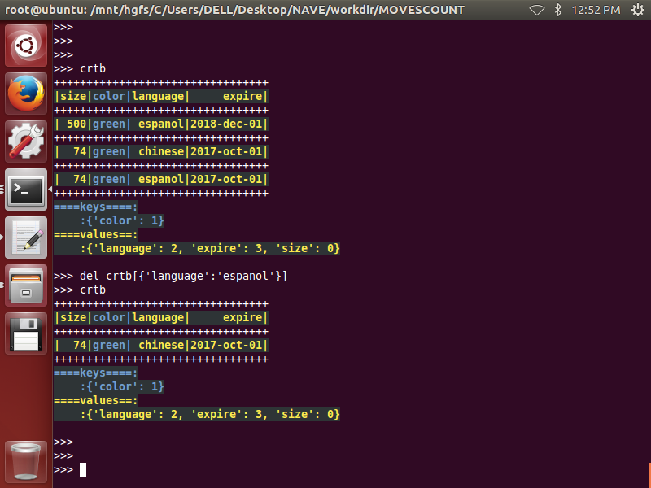

# dlixhict-didactic
>__1. transform and converting between html,json,python-dict,command-line,dir-path__  
__2. dict, list, tuple, toolset__

# install
>__pip3 install xdict__

# INTRODUCE:

for detailed usage and functions please refer to:
-------------------------------------------------

----------------------------------------------------------
>├── [console_color](ReadMeDetailed/console_color.md)      
├── CrtableReadMe  
>>>>├── [crtable](ReadMeDetailed/CrtableReadMe/crtable.md)  

>├── [hdict_cmdline](ReadMeDetailed/hdict_cmdline.md)    
├── [hdict_object](ReadMeDetailed/hdict_object.md)   
├── [hdict_xml](ReadMeDetailed/hdict_xml.md)  
├── [jprint](ReadMeDetailed/jprint.md)  
├── [ltdict](ReadMeDetailed/ltdict.md)  
├── [structure](ReadMeDetailed/structure.md)  
├── TestReadMe  
>>>>├── [genrand](ReadMeDetailed/genrand.md)  

>├── [tuple_list](ReadMeDetailed/tuple_list.md)  
└── [utils](ReadMeDetailed/utils.md)

-------------------------------------------------------

## Part1. [crtable](ReadMeDetailed/CrtableReadMe/crtable.md)
__1. init__  
-----------
		import xdict.CrtableLib.crtable as xcr
		colnameslist = ['size','color','language','expire']
		keynameslist = ['size','language']
		table = {}
		table[0] = {0: 500, 1: 'green', 2: 'espanol', 3: '2018-dec-01'}
		table[1] = {0: 74, 1: 'green', 2: 'chinese', 3: '2017-oct-01'}
		table[2] = {0: 74, 1: 'green', 2: 'espanol', 3: '2017-oct-01'}
		crtb = xcr.crtable(colnameslist = colnameslist,table=table,keynameslist = keynameslist)
		crtb

 

__2. getitem__
--------------  
		from xdict.jprint import pobj
		keys_1 = {'language':'espanol','color':'green'}
		values_1 = crtb[keys_1]
		keys_2 = {'color':'green'}
		values_2 = crtb[keys_2]
		values_1
		pobj(values_1)
		values_2
		pobj(values_2)  

  
  

__3. .select_rownums(keysorvalues)__  
------------------------------------
		crtb
		keysorvalues = {'color':'green'}
		rownums = crtb.select_rownums(keysorvalues)
		rownums
		keysorvalues = {'language':'espanol'}
		rownums = crtb.select_rownums(keysorvalues)
		rownums  

 

__4. .select_attribs(keysorvalues)__
------------------------------------
		crtb
		keysorvalues = {'color':'green'}
		attribs = crtb.select_attribs(keysorvalues)
		pobj(attribs)
		keysorvalues = {'language':'espanol'}
		attribs = crtb.select_attribs(keysorvalues)
		pobj(attribs)  
		
  

  

__5. .select_values(keys)__
---------------------------
		crtb
		keys = {'language':'espanol'}
		values = crtb.select_values(keys)
		pobj(values)
		keys = {'language':'espanol','size':74}
		values = crtb.select_values(keys)
		pobj(values)  
		
  
  

__6. .choose_cols(colslist)__
-----------------------------
		crtb
		colslist = [0,2]
		subcols = crtb.choose_cols(colslist)
		xcr.show_crtable(subcols)
		colslist = ['size','color']
		subcols = crtb.choose_cols(colslist)
		xcr.show_crtable(subcols)  

  
  

__7. .choose_rows(rownumslist)__
--------------------------------
		crtb
		rownumslist = [1,2]
		subrows = crtb.choose_rows(rownumslist)
		xcr.show_crtable(subrows)  
		
 

__8. .append_row(row)__
-----------------------
		crtb
		row = {'size': 700, 'color': 'pink', 'language': 'espanol'}
		crtb.append_row(row)
		crtb

__9. .append_rows(rows)__
-------------------------
		crtb
		rows = [{'size': 555, 'color': 'yellow', 'language': 'chinese'},
		        {'size': 555, 'color': 'yellow', 'language': 'korean'}]
		crtb.append_rows(rows)
		crtb

  

__10. .prepend_row(row)__
-------------------------
		crtb
		row = {'size': 700, 'color': 'pink', 'language': 'espanol'}
		crtb.prepend_row(row)
		crtb

  

__11. .prepend_rows(rows)__
---------------------------
		crtb
		rows = [{'size': 555, 'color': 'yellow', 'language': 'chinese'},
		        {'size': 555, 'color': 'yellow', 'language': 'korean'}]
		crtb.prepend_rows(rows)
		crtb

  

__12. .append_col(col)__
------------------------
		crtb
		col = {'owner':['dli','dli','dli','dli']}
		crtb.append_col(col)
		crtb

  

__13. .append_cols(cols)__
--------------------------
		crtb
		cols = [{'id':['2271','2272','2273','2274']},
        		{'tid':['t1','t2','t3','t4']}]
		crtb.append_cols(cols)
		crtb

  

__14. .prepend_col(col)__
-------------------------
		crtb
		col = {'owner':['dli','dli','dli','dli']}
		crtb.prepend_col(col)
		crtb 
		
  

__15. .prepend_cols(cols)__
---------------------------
		crtb
		cols = [{'nickname':['kk','vv','tt','dd']},
		        {'uid':['u1','u2','u3','u4']}]

		crtb.prepend_cols(cols)
		crtb  
		
 

__16. .__setitem__(keys,values)__
---------------------------------
		crtb
		keys = {'size':88,'language':'korean'}
		values = {'color':'azure'}
		crtb[keys] = values
		crtb
		keys = {'language':'espanol'}
		values = {'color':'darkblack'}
		crtb[keys] = values
		crtb  
		
 

__17. .modify_first_row(keys)__
---------------------------------
		crtb
		keys = {'size':74}
		values = {'color':'purple'}
		crtb.modify_first_row(keys,values)
		crtb  
		
 

__18. .modify_last_row(keys)__
------------------------------
		crtb
		keys = {'size':74}
		values = {'color':'purple'}
		crtb.modify_last_row(keys,values)
		crtb

 

__19. .modify_specific_row(keys)__
----------------------------------
		crtb
		keys = {'color':'green'}
		values = {'language':'korean'}
		crtb.modify_specific_row(keys,values,1)
		crtb

 

__20. .modify_all_rows(keys)__
------------------------------
		crtb
		keys = {'color':'green'}
		values = {'language':'korean'}
		crtb.modify_all_rows(keys,values)
		crtb

 

__21. .modify_col(colnum_or_colname,col)__
------------------------------------------
		crtb
		col = {0:50,1:50,2:50}
		crtb.modify_col(0,col)
		crtb
		col = {0:60,1:60}
		crtb.modify_col('size',col)
		crtb

 

 

__22. .insert_col(colnum,col)__
-------------------------------
		crtb
		col = {'owner':['dli','dlx','dly','dlz']}
		crtb.insert_col(1,col)
		crtb

 

__23. .insert_cols(colnumlist,cols)__
-------------------------------------
		crtb
		cols = [
		    {'owner':['dli','dlx','dly','dlz']},
		    {'uid':['ua','ub','uc','ud']}
		]
		colnumlist = [1,3]
		crtb.insert_cols(colnumlist,cols)
		crtb

 

__24. .insert_row(rownum,row)__
-------------------------------
		crtb
		row = {'size': 8888, 'color': 'blue', 'language': 'russian', 'expire': '2018-dec-01'}
		crtb.insert_row(1,row)
		crtb
		

 

__25. .insert_rows(rownumlist,rows)__
-------------------------------------
		crtb
		rows = [{'size': 8888, 'color': 'blue', 'language': 'russian', 'expire': '2018-dec-01'},
		        {'size': 666, 'color': 'azure', 'language': 'russian', 'expire': '2017-dec-01'}]
		rownumlist = [0,2]
		crtb.insert_rows(rownumlist,rows)
		crtb

 

__26. .__delitem__(keys)__
---------------------------
		crtb
		keys =  {'language':'espanol'}
		del crtb[keys]
		crtb

 

__27. .delete_first_row(keys)__
-------------------------------
		crtb
		keys =  {'language':'espanol'}
		crtb.delete_first_row(keys)
		crtb
		

__28. .delete_last_row(keys)__
------------------------------
		crtb
		keys =  {'language':'espanol'}
		crtb.delete_last_row(keys)
		crtb
		

__29. .delete_specific_row(keys,whichrow)__
-------------------------------------------
		crtb
		keys =  {'language':'espanol'}
		crtb.delete_specific_row(keys,1)
		crtb
		

__30. .delete_all_rows(keys)__
------------------------------
		crtb
		keys =  {'language':'espanol'}
		crtb.delete_all_rows(keys)
		crtb
		

__31. .del_col(colnum_or_colname)__
-----------------------------------
		crtb
		crtb.del_col('language')
		crtb
		crtb.del_col(0)
		crtb
		

__32. del_cols(colnum_or_colname)__
-----------------------------------
		crtb
		crtb.del_cols(['size','language'])
		crtb
		crtb
		crtb.del_cols([0,3])
		crtb  
		

__33. .keys()__
---------------
		crtb
		crtb.keys()

__34. .values()__
-----------------
		crtb
		crtb.values()

__35. .items()__
----------------
		crtb
		crtb.items()

__36. .clear()__
----------------
		crtb
		crtb.clear()
		crtb

__37. .copy()__
---------------
		crtb
		crtb.copy()
		
__38. "*"__
-----------
		table_1 = {
		              0: {0: 'a1', 1: 'b1'}, 
		              1: {0: 'a1', 1: 'b2'} 
		          }
		table_2 = {
		              0: {0: 'a1', 1: 'b2'}, 
		              1: {0: 'a1', 1: 'b3'} 
		          }
		colnameslist = ['A','B']
		keynameslist = ['A']
		crtb1 = xcr.crtable(colnameslist = colnameslist,table=table_1,keynameslist = keynameslist)
		crtb2 = xcr.crtable(colnameslist = colnameslist,table=table_2,keynameslist = keynameslist)
		crtb = crtb1 * crtb2
		crtb
		

__39. .project(crtb2)__
-----------------------
		crtb
		colnameslist = ['color','language']
		crtb.project(colnameslist)
		crtb
		

		
__40. "+"__
------------
		table_1 = {
		              0: {0: 'a1', 1: 'b1'}, 
		              1: {0: 'a1', 1: 'b2'} 
		          }
		table_2 = {
		              0: {0: 'a1', 1: 'b2'}, 
		              1: {0: 'a1', 1: 'b3'} 
		          }
		colnameslist = ['A','B']
		keynameslist = ['A']
		crtb1 = crtable(colnameslist = colnameslist,table=table_1,keynameslist = keynameslist)
		crtb2 = crtable(colnameslist = colnameslist,table=table_2,keynameslist = keynameslist)
		crtb = crtb1 + crtb2
		crtb

		
