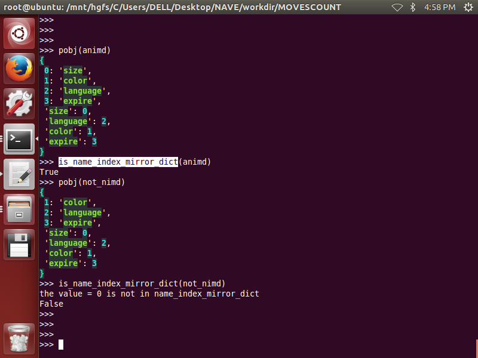
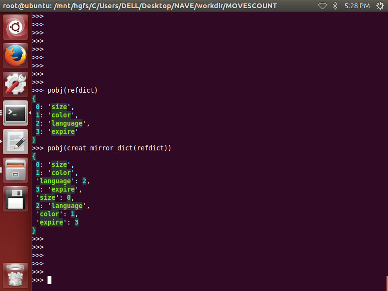
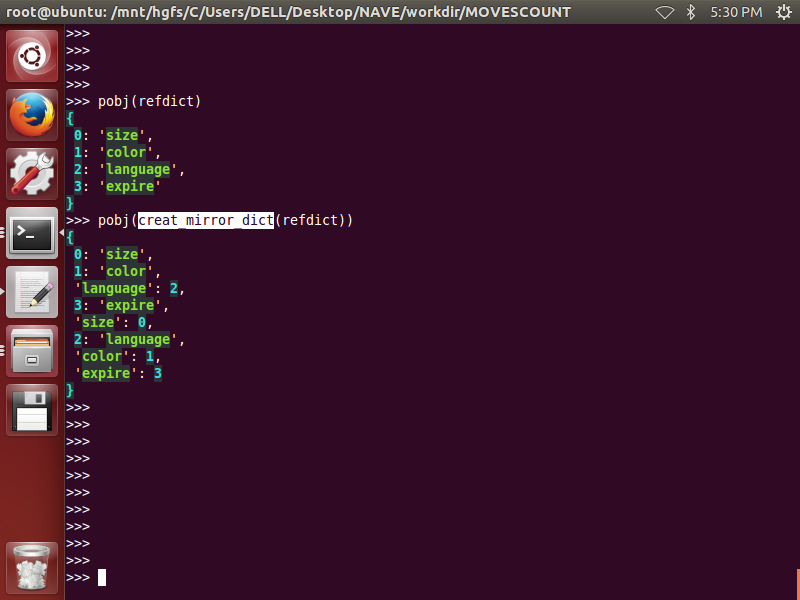
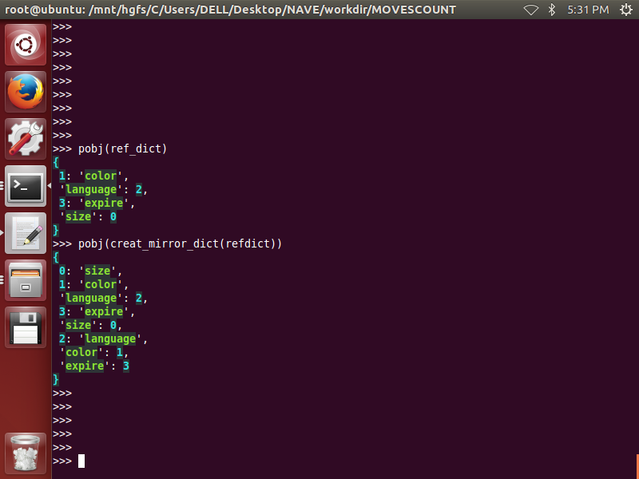
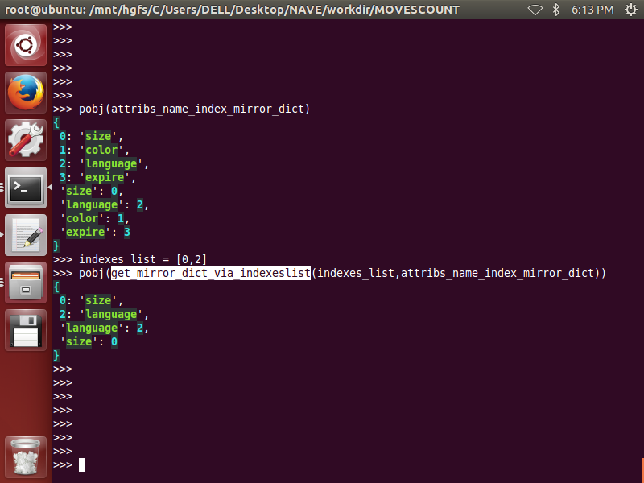
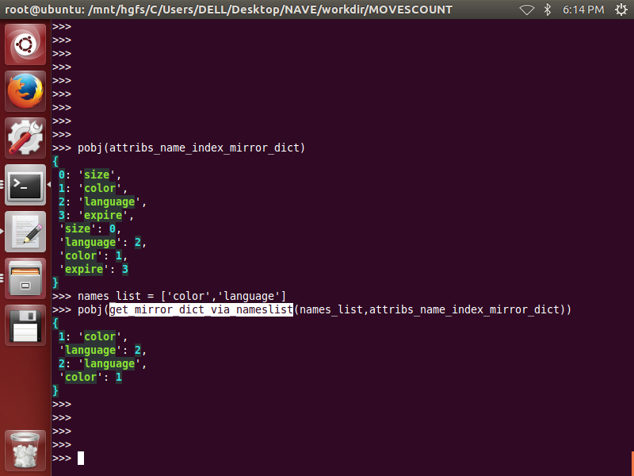
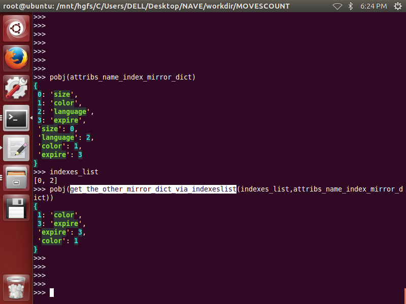
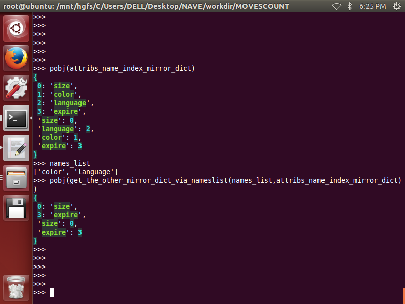
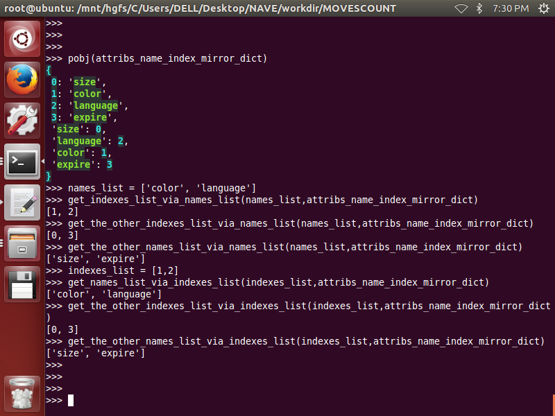
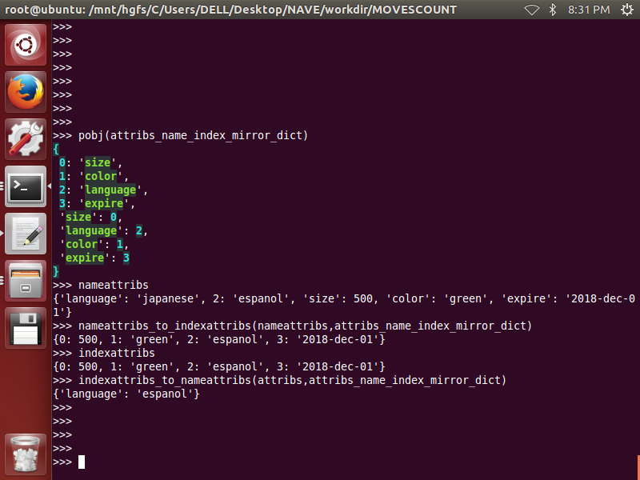

# Introduce
>two-dimension ltdict  used as a multi-keys/multi-values  dict  
or used as a light-weight small database  
	
>for example:

		+++++++++++++++++++++++++++++++++++++++++++
		+++|  size|    color| language|    expire |
		+++++++++++++++++++++++++++++++++++++++++++
		+++|     0|        1|        2|       3   |
		+++++++++++++++++++++++++++++++++++++++++++
		+ 0|   500|    green|  espanol|2018-dec-01|
		+++++++++++++++++++++++++++++++++++++++++++
		+ 1|    74|    green|  chinese|2017-oct-01|
		+++++++++++++++++++++++++++++++++++++++++++
		+ 2|   300|darkblack|  spanish|2017-oct-01|
		+++++++++++++++++++++++++++++++++++++++++++
		+ 3|100000|     blue|  english|2018-dec-01|
		+++++++++++++++++++++++++++++++++++++++++++
		+ 4|   500|    green|  english|2017-oct-01|
		+++++++++++++++++++++++++++++++++++++++++++  

>the upper  table will be stored in a two-dimensiton ltdict as below:

    >>> table[0]
    {0: 500, 1: 'green', 2: 'espanol', 3: '2018-dec-01'}
    >>> table[1]
    {0: 74, 1: 'green', 2: 'chinese', 3: '2017-oct-01'}
    >>> table[2]
    {0: 300, 1: 'darkblack', 2: 'spanish', 3: '2017-oct-01'}
    >>> table[3]
    {0: 100000, 1: 'blue', 2: 'english', 3: '2018-dec-01'}
    >>> table[4]
    {0: 500, 1: 'green', 2: 'english', 3: '2017-oct-01'}
    >>>
 
>for each row :each column is a attrib, all columns are called attribs:
>>attribs: {0: 500, 1: 'green', 2: 'espanol', 3: '2018-dec-01'}  
attribnames: size,color,language,expire  
each attribname must be string  
attribindexes:0,1,2,3  
each attribindex must be int  
attrib\_name\_index\_mirror\_dict: animd  

	{
		0: 'size', 
		1: 'color', 
		2: 'language', 
		3: 'expire', 
		'size': 0, 
		'language': 2, 
		'color': 1, 
		'expire': 3
	}

>keys are a subset of attribs: {1:'green',2:'espanol'},    
values are a subset of attribs: {0:'500',3:'2018-dec-01'},    
keys have no intersection with values,  
attribs consist of keys and values: {0: 500, 1: 'green', 2: 'espanol', 3: '2018-dec-01'},       
>>keynames: color,language  
each keyname must be string  
keyindexes:1,2  
each keyindex must be int  
valunames: size,expire  
each valuename must be string  
valueindexes:0,3  
each valueindex must be int  
key\_name\_index\_mirror\_dict: knimd  

		{
			1: 'color', 
			2: 'language', 
			'language': 2, 
			'color': 1
		}

>>value\_name\_index\_mirror_dict: vnimd  

		{
			0: 'size', 
			3: 'expire', 
			'size': 0, 
			'expire': 3
		}  
  
  
> crtable is a dict as below: 

	crtable = {  
			'table': {...two-dimension ltdict...}, 
			'animd': {...attrib_name_index_mirror_dict...},  
			'knimd': {...key_name_index_mirror_dict...},    
			'vnimd': {...value_name_index_mirror_dict...}  
		}

# QuickStart
1.
2.
3.
4.
5.
6.

# Functions  
## part_1: name_index_mirror_dict
__1. is_name_index_mirror_dict(name_index_mirror_dict)__  
-------------------------------------------------------- 
 

__2. creat_mirror_dict(refdict):__
----------------------------------

  

__3. get_indexonly_refdict(refdict,**kwargs)__
----------------------------------------------  
__4. get_nameonly_refdict(refdict,**kwargs)__
---------------------------------------------
  

__5. get_mirror_dict_via_indexeslist(indexes_list,attribs_name_index_mirror_dict)__
---------------------------------------------------------------------------- 
  

__6. get_mirror_dict_via_nameslist(names_list,attribs_name_index_mirror_dict)__
------------------------------------------------------------------------
  

__7. get_the_other_mirror_dict_via_indexeslist(indexes_list,attribs_name_index_mirror_dict)__
--------------------------------------------------------------------------------------  
  

__8. get_the_other_mirror_dict_via_nameslist(names_list,attribs_name_index_mirror_dict)__
----------------------------------------------------------------------------------
  

__9. get_indexes_list_via_names_list(names_list,attribs_name_index_mirror_dict)__
---------------------------------------------------------------------------------
__10. get_names_list_via_indexes_list(indexes_list,attribs_name_index_mirror_dict)__
------------------------------------------------------------------------------------
__11. get_the_other_indexes_list_via_indexes_list(indexes_list,attribs_name_index_mirror_dict)__
------------------------------------------------------------------------------------------------
__12. get_the_other_indexes_list_via_names_list(names_list,attribs_name_index_mirror_dict)__
--------------------------------------------------------------------------------------------
__13. get_the_other_names_list_via_indexes_list(indexes_list,attribs_name_index_mirror_dict)__
----------------------------------------------------------------------------------------------
__14. get_the_other_names_list_via_names_list(names_list,attribs_name_index_mirror_dict)__
------------------------------------------------------------------------------------------
  

## part_2:attribs_keys_values
__1. nameattribs_to_indexattribs(attribs,attribs_name_index_mirror_dict)__
--------------------------------------------------------------------------
__2. indexattribs_to_nameattribs(attribs,attribs_name_index_mirror_dict)__
--------------------------------------------------------------------------
 

