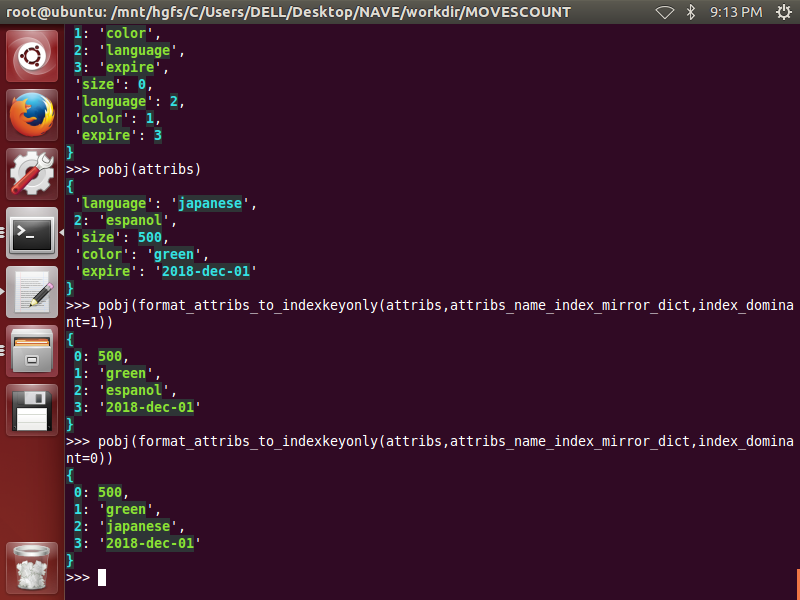
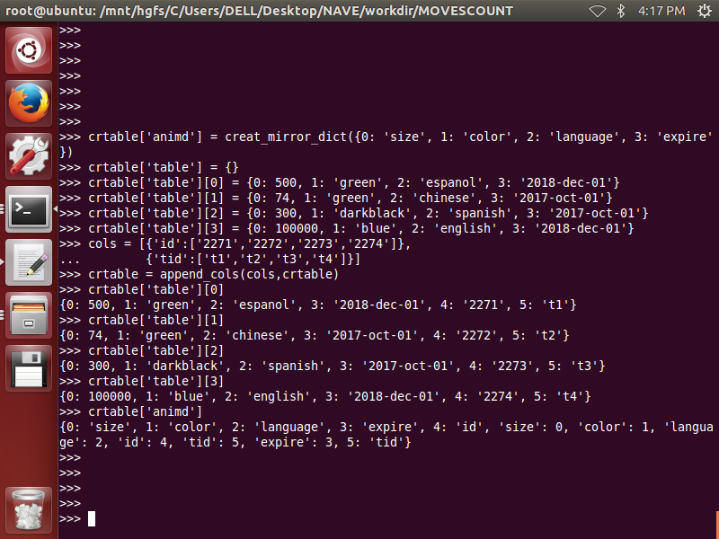
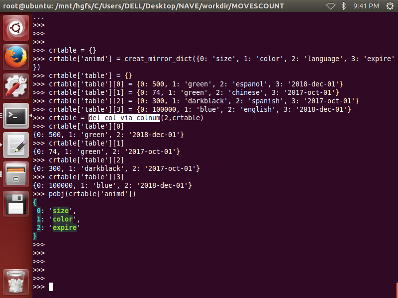
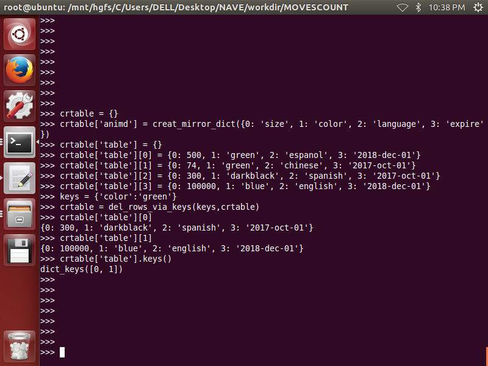
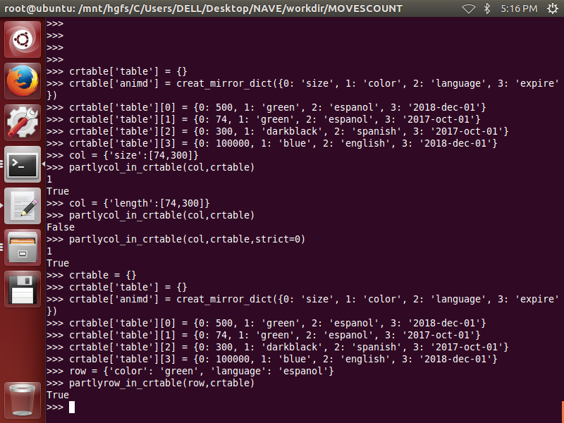
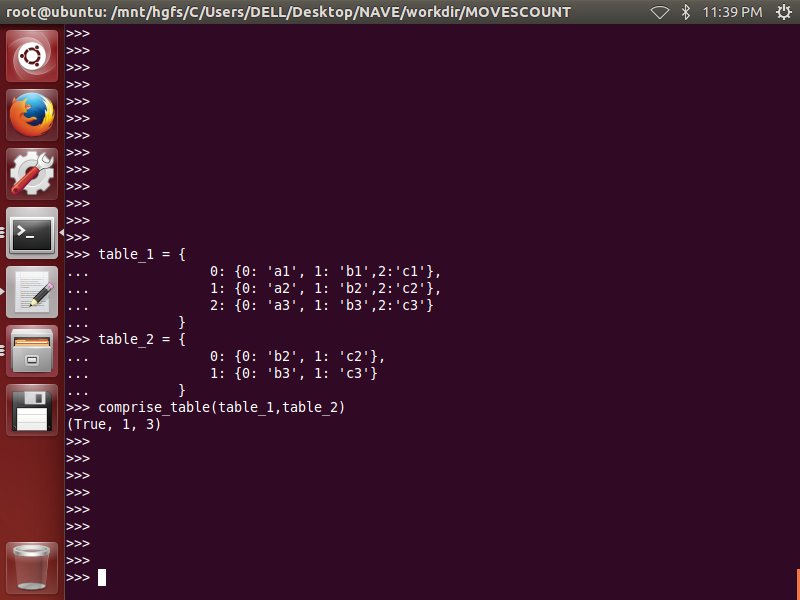
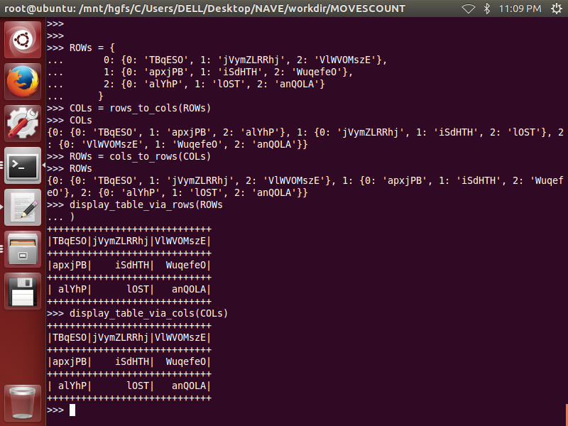

# Introduce
>two-dimension ltdict  used as a multi-keys/multi-values  dict  
or used as a light-weight small database  
	
>for example:

		+++++++++++++++++++++++++++++++++++++++++++
		+++|  size|    color| language|    expire |
		+++++++++++++++++++++++++++++++++++++++++++
		+++|     0|        1|        2|       3   |
		+++++++++++++++++++++++++++++++++++++++++++
		+ 0|   500|    green|  espanol|2018-dec-01|
		+++++++++++++++++++++++++++++++++++++++++++
		+ 1|    74|    green|  chinese|2017-oct-01|
		+++++++++++++++++++++++++++++++++++++++++++
		+ 2|   300|darkblack|  spanish|2017-oct-01|
		+++++++++++++++++++++++++++++++++++++++++++
		+ 3|100000|     blue|  english|2018-dec-01|
		+++++++++++++++++++++++++++++++++++++++++++
		+ 4|   500|    green|  english|2017-oct-01|
		+++++++++++++++++++++++++++++++++++++++++++  

>the upper  table will be stored in a two-dimensiton ltdict as below:

    >>> table[0]
    {0: 500, 1: 'green', 2: 'espanol', 3: '2018-dec-01'}
    >>> table[1]
    {0: 74, 1: 'green', 2: 'chinese', 3: '2017-oct-01'}
    >>> table[2]
    {0: 300, 1: 'darkblack', 2: 'spanish', 3: '2017-oct-01'}
    >>> table[3]
    {0: 100000, 1: 'blue', 2: 'english', 3: '2018-dec-01'}
    >>> table[4]
    {0: 500, 1: 'green', 2: 'english', 3: '2017-oct-01'}
    >>>
 
>for each row :each column is a attrib, all columns are called attribs:
>>attribs: {0: 500, 1: 'green', 2: 'espanol', 3: '2018-dec-01'}  
attribnames: size,color,language,expire  
each attribname must be string  
attribindexes:0,1,2,3  
each attribindex must be int  
attrib\_name\_index\_mirror\_dict: animd  

	{
		0: 'size', 
		1: 'color', 
		2: 'language', 
		3: 'expire', 
		'size': 0, 
		'language': 2, 
		'color': 1, 
		'expire': 3
	}

>keys are a subset of attribs: {1:'green',2:'espanol'},    
values are a subset of attribs: {0:'500',3:'2018-dec-01'},    
keys have no intersection with values,  
attribs consist of keys and values: {0: 500, 1: 'green', 2: 'espanol', 3: '2018-dec-01'},       
>>keynames: color,language  
each keyname must be string  
keyindexes:1,2  
each keyindex must be int  
valunames: size,expire  
each valuename must be string  
valueindexes:0,3  
each valueindex must be int  
key\_name\_index\_mirror\_dict: knimd  

		{
			1: 'color', 
			2: 'language', 
			'language': 2, 
			'color': 1
		}

>>value\_name\_index\_mirror_dict: vnimd  

		{
			0: 'size', 
			3: 'expire', 
			'size': 0, 
			'expire': 3
		}  
  
  
> crtable is a dict as below: 

	crtable = {  
			'table': {...two-dimension ltdict...}, 
			'animd': {...attrib_name_index_mirror_dict...},  
			'knimd': {...key_name_index_mirror_dict...},    
			'vnimd': {...value_name_index_mirror_dict...},
			'keynameslist' :[...keynameslist...],
			'valuenameslist' :[...valuenameslist...],
			'colnameslist' :[...colnameslist...]
		}

# Functions  
## part_1: name_index_mirror_dict
__1. is_name_index_mirror_dict(name_index_mirror_dict)__  
-------------------------------------------------------- 
 

__2. creat_mirror_dict(refdict):__
----------------------------------

  

__3. get_indexonly_refdict(refdict,**kwargs)__
----------------------------------------------  
__4. get_nameonly_refdict(refdict,**kwargs)__
---------------------------------------------
  

__5. get_mirror_dict_via_indexeslist(indexes_list,attribs_name_index_mirror_dict)__
---------------------------------------------------------------------------- 
  

__6. get_mirror_dict_via_nameslist(names_list,attribs_name_index_mirror_dict)__
------------------------------------------------------------------------
  

__7. get_the_other_mirror_dict_via_indexeslist(indexes_list,attribs_name_index_mirror_dict)__
--------------------------------------------------------------------------------------  
  

__8. get_the_other_mirror_dict_via_nameslist(names_list,attribs_name_index_mirror_dict)__
----------------------------------------------------------------------------------
  

__9. get_indexes_list_via_names_list(names_list,attribs_name_index_mirror_dict)__
---------------------------------------------------------------------------------
__10. get_names_list_via_indexes_list(indexes_list,attribs_name_index_mirror_dict)__
------------------------------------------------------------------------------------
__11. get_the_other_indexes_list_via_indexes_list(indexes_list,attribs_name_index_mirror_dict)__
------------------------------------------------------------------------------------------------
__12. get_the_other_indexes_list_via_names_list(names_list,attribs_name_index_mirror_dict)__
--------------------------------------------------------------------------------------------
__13. get_the_other_names_list_via_indexes_list(indexes_list,attribs_name_index_mirror_dict)__
----------------------------------------------------------------------------------------------
__14. get_the_other_names_list_via_names_list(names_list,attribs_name_index_mirror_dict)__
------------------------------------------------------------------------------------------
  

__15. naturalize_refdict(refdict,**kwargs)__
--------------------------------------------

## part_2:attribs_keys_values
__1. nameattribs_to_indexattribs(attribs,attribs_name_index_mirror_dict)__
--------------------------------------------------------------------------
__2. indexattribs_to_nameattribs(attribs,attribs_name_index_mirror_dict)__
--------------------------------------------------------------------------
 

__3. format_attribs_indexdominant(attribs,attribs_name_index_mirror_dict)__
---------------------------------------------------------------------------
__4. format_keys_indexdominant(keys,attribs_name_index_mirror_dict)__
---------------------------------------------------------------------
__5. format_values_indexdominant(values,attribs_name_index_mirror_dict)__
-------------------------------------------------------------------------
  

__6. format_attribs_namedominant(attribs,attribs_name_index_mirror_dict)__
--------------------------------------------------------------------------
__7. format_keys_namedominant(keys,attribs_name_index_mirror_dict)__
--------------------------------------------------------------------
__8. format_values_namedominant(values,attribs_name_index_mirror_dict)__
------------------------------------------------------------------------
 

__9. format_attribs_to_indexkeyonly(attribs,attribs_name_index_mirror_dict,**kwargs)__
--------------------------------------------------------------------------------------
__10. format_keys_to_indexkeyonly(keys,attribs_name_index_mirror_dict)__
------------------------------------------------------------------------
__11. format_values_to_indexkeyonly(values,attribs_name_index_mirror_dict)__
----------------------------------------------------------------------------
  

__12. format_attribs_to_namekeyonly(attribs,attribs_name_index_mirror_dict,**kwargs)__
--------------------------------------------------------------------------------------
__13. format_keys_to_namekeyonly(keys,attribs_name_index_mirror_dict)__
-----------------------------------------------------------------------
__14. format_values_to_namekeyonly(values,attribs_name_index_mirror_dict)__
---------------------------------------------------------------------------
  

__15. indextable_to_nametable(indextable,attribs_name_index_mirror_dict)__
--------------------------------------------------------------------------
__16. nametable_to_indextable(nametable,attribs_name_index_mirror_dict)__
--------------------------------------------------------------------------
  

## part_3: basic_select

__1. get_seqslist_via_attribs(attribs,crtable)__
------------------------------------------------
  

__2. get_seqslist_via_keys(keys,crtable)__
------------------------------------------
__3. get_seqslist_via_values(values,crtable)__
----------------------------------------------
  

__4. get_values_in_attribs(keys,attribs,attribs_name_index_mirror_dict,**kwargs)__
----------------------------------------------------------------------------------
__5. get_keys_in_attribs(values,attribs,attribs_name_index_mirror_dict,**kwargs)__
----------------------------------------------------------------------------------
  

__6. get_valueslist_via_keys(keys,crtable,**kwargs)__
-----------------------------------------------------
__7. get_keyslist_via_values(values,crtable,**kwargs)__
-------------------------------------------------------
  

__8. get_column_via_attribindex(index,crtable)__
------------------------------------------------
__9. get_column_via_attribname(name,crtable)__
----------------------------------------------
  

__10. get_attribslist_of_column_via_attribindex(index,crtable)__
----------------------------------------------------------------
__11. get_attribslist_of_column_via_attribname(name,crtable)__
--------------------------------------------------------------

__12. get_seqslist_of_column_via_attribindex(index,crtable)__
-------------------------------------------------------------
__13. get_seqslist_of_column_via_attribname(name,crtable)__
-----------------------------------------------------------
  

__14. get_domainset_of_column_via_attribindex(index,crtable)__
--------------------------------------------------------------
__15. get_domainset_of_column_via_attribname(name,crtable)__
------------------------------------------------------------
  

## part4: creat,init,append,prepend,del,modify,insert

__1. creat_empty_crtable(column_name_dict,**kwargs)__
-----------------------------------------------------
 

__2. expand_part_attribs(attribs,attribs_name_index_mirror_dict,**kwargs)__
---------------------------------------------------------------------------
 

__3. append_row(row,crtable)__
------------------------------

__4. append_col(col,crtable)__
------------------------------
  

__5. append_rows(rows,crtable)__
--------------------------------
 

__6. append_cols(cols,crtable)__
--------------------------------
 

__7. prepend_row(row,crtable)__
------------------------------

__8. prepend_col(col,crtable)__
------------------------------
  

__9. prepend_rows(rows,crtable)__
--------------------------------
 

__10. prepend_cols(cols,crtable)__
--------------------------------
 

__11. del_col_via_colnum(colnum,crtable,**kwargs)__
---------------------------------------------------
__12. del_cols_via_colnumslist(colnumlist,crtable,**kwargs)__
-------------------------------------------------------------

__13. del_col_via_colname(colname,crtable,**kwargs)__
-----------------------------------------------------
__14. del_cols_via_colnameslist(colnameslist,crtable,**kwargs)__
----------------------------------------------------------------
    
 
 
__15. del_rows_via_attribs(attribs,crtable,**kwargs)__
------------------------------------------------------
__16. del_rows_via_keys(keys,crtable,**kwargs)__
------------------------------------------------
__17. del_rows_via_values(values,crtable,**kwargs)__
----------------------------------------------------
 

__18. modify_rows_via_seq(seq,crtable,modified_to)__
----------------------------------------------------

__19. modify_rows_via_attribs(attribs,crtable,modified_to)__
-------------------------------------------------------------

__20. modify_rows_via_keys(keys,crtable,modified_to,**kwargs)__
---------------------------------------------------------------

__21. modify_rows_via_values(values,crtable,modified_to,**kwargs)__
-------------------------------------------------------------------

__22. modify_col_via_colnum(colnum,crtable,modified_to)__
---------------------------------------------------------

__23. modify_col_via_colname(colname,crtable,modified_to)__
-----------------------------------------------------------  
 

__24. insert_col(colnum,colname,col,crtable,**kwargs)__
-------------------------------------------------------
 

__25. insert_cols(colnumlist,colnamelist,cols,crtable,**kwargs)__
------------------------------------------------------------------

__26. insert_row(rownum,row,crtable)__
--------------------------------------

__27. insert_rows(rownumlist,rows,crtable,**kwargs)__
-----------------------------------------------------

## part5: relationship 

__1.  product_mirror_dicts(mds)__
---------------------------------
  

__2. product_two_tables(table_1,table_2)__
------------------------------------------
 

__3. product_tables(tables)__
-----------------------------
  

__4. product_crtables(crtables)__
---------------------------------
  

__5. project_mirror_dict(md,colnameslist)__
-------------------------------------------
  

__6. project_table(colnumslist,table,**kwargs)__
------------------------------------------------
  

__7. project_crtable(colnameslist,crtable,**kwargs)__
-----------------------------------------------------
  

__8. row_in_crtable(row,crtable)__
----------------------------------
 

__9. col_in_crtable(col,crtable,**kwargs)__
-------------------------------------------
  

__10. partlyrow_in_crtable(row,crtable)__
------------------------------------------
 

__11. partlycol_in_crtable(col,crtable,**kwargs)__
---------------------------------------------------
 

__12. unique_crtable(crtable,**kwargs)__
----------------------------------------
  

__13. union_crtables(crtables)__
--------------------------------
 

__14. intersec_two_crtables(crtable_1,crtable_2,**kwargs)__
-----------------------------------------------------------
  

__15. intersec_crtables(crtables,**kwargs)__
--------------------------------------------
  

__16. naturalize_table(table)__
-------------------------------
  

__17. naturalize_crtable(crtable)__
-----------------------------------
  

__18. comprise_table(table_1,table_2)__
---------------------------------------
  

__19. comprise_crtable(crtable_1,crtable_2,**kwargs)__
------------------------------------------------------
  

__20. equal(crtable_1,crtable_2,**kwargs)__
-------------------------------------------
  

__21. get_newcrtable_via_colnumslist(colnumslist,crtable,**kwargs)__
--------------------------------------------------------------------
  

__22. get_newcrtable_via_colnameslist(colnameslist,crtable,**kwargs)__
-----------------------------------------------------------------------
  

__23. diff_two_crtables(crtable_1,crtable_2,**kwargs)__
-------------------------------------------------------
  

__24. thetajoin_two_crtables(colnameslist_1,crtable_1,colnameslist_2,crtable_2,theta_function,**kwargs)__
----------------------------------------------------------------------------------------------------------

  

__25. equijoin_two_crtables(colnameslist_1,crtable_1,colnameslist_2,crtable_2,**kwargs)__
-----------------------------------------------------------------------------------------
 

__26. naturaljoin_mirror_dict(md)__
-----------------------------------
  

__27. get_image_sets_dict(crtable,colnameslist)__
-------------------------------------------------
  

__28. divide_two_crtables(crtable_1,crtable_2,colnameslist,**kwargs)__
----------------------------------------------------------------------
  

__29. is_single_candidate_key(crtable,name)__
---------------------------------------------
 

__30. is_candidate_key_combo(crtable,colnameslist)__
----------------------------------------------------
 

__31. get_all_candidate_key_combo(crtable)__
--------------------------------------------
  

## part6: show and display

__1. max_rows_in_table_via_cols_dict(COLs)__
--------------------------------------------
__2. max_cols_in_table_via_rows_dict(ROWs)__
--------------------------------------------
__3. padding_rows(ROWs)__
-------------------------
__4. padding_cols(COLs)__
-------------------------
  

__5. rows_to_cols(ROWs)__
-------------------------
__6. cols_to_rows(COLs)__
-------------------------
__7. display_table_via_rows(ROWs)__
-----------------------------------
__8. display_table_via_cols(COLs)__
-----------------------------------

__9. show_crtable(crtable)__
----------------------------

