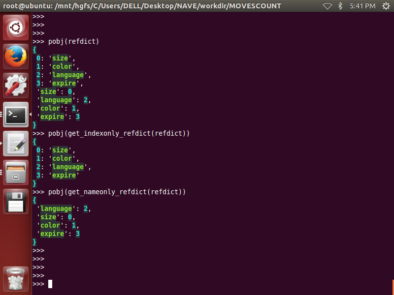

# crtable
>two-dimension ltdict  used as a multi-keys/multi-values  dict  
or used as a light-weight small database  
	
>for example:

		+++++++++++++++++++++++++++++++++++++++++++
		+++|  size|    color| language|    expire |
		+++++++++++++++++++++++++++++++++++++++++++
		+++|     0|        1|        2|       3   |
		+++++++++++++++++++++++++++++++++++++++++++
		+ 0|   500|    green|  espanol|2018-dec-01|
		+++++++++++++++++++++++++++++++++++++++++++
		+ 1|    74|    green|  chinese|2017-oct-01|
		+++++++++++++++++++++++++++++++++++++++++++
		+ 2|   300|darkblack|  spanish|2017-oct-01|
		+++++++++++++++++++++++++++++++++++++++++++
		+ 3|100000|     blue|  english|2018-dec-01|
		+++++++++++++++++++++++++++++++++++++++++++
		+ 4|   500|    green|  english|2017-oct-01|
		+++++++++++++++++++++++++++++++++++++++++++  

>the upper  table will be stored in a two-dimensiton ltdict as below:

    >>> table[0]
    {0: 500, 1: 'green', 2: 'espanol', 3: '2018-dec-01'}
    >>> table[1]
    {0: 74, 1: 'green', 2: 'chinese', 3: '2017-oct-01'}
    >>> table[2]
    {0: 300, 1: 'darkblack', 2: 'spanish', 3: '2017-oct-01'}
    >>> table[3]
    {0: 100000, 1: 'blue', 2: 'english', 3: '2018-dec-01'}
    >>> table[4]
    {0: 500, 1: 'green', 2: 'english', 3: '2017-oct-01'}
    >>>
 
>each column is a attrib, all columns are called attribs:
>>attribnames: size,color,language,expire  
each attribname must be string  
attribindexes:0,1,2,3  
each attribindex must be int  
attribs\_crossref\_dict: acd  

	{
		0: 'size', 
		1: 'color', 
		2: 'language', 
		3: 'expire', 
		'size': 0, 
		'language': 2, 
		'color': 1, 
		'expire': 3
	}

>keys are a subset of attribs,    
values are a subset of attribs,  
keys have no intersection with values,  
attribs consist of keys and values:    
>>keynames: color,language  
each keyname must be string  
keyindexes:1,2  
each keyindex must be int  
valunames: size,expire  
each valuename must be string  
valueindexes:0,3  
each valueindex must be int  
keys\_crossref\_dict: kcd  

		{
			1: 'color', 
			2: 'language', 
			'language': 2, 
			'color': 1
		}

>>values\_crossref\_dict: vcd  

		{
			0: 'size', 
			3: 'expire', 
			'size': 0, 
			'expire': 3
		}  
  
  
> crtable is a dict as below: 

	crtable = {  
			'table': {...two-dimension ltdict...}, 
			'acd': {...attribs_crossref_dict...},  
			'kcd': {...keys_crossref_dict...},    
			'vcd': {...values_crossref_dict...}  
		}

# crossref_dict
__1. is_crossref_dict(crossref_dict):__  
--------------------------------------- 
  

__2. creat_crossref_dict_from_refdict(refdict):__
-------------------------------------------------

  

__3. get_indexonly_refdict(refdict,**kwargs)__
----------------------------------------------  

__4. get_nameonly_refdict(refdict,**kwargs)__
---------------------------------------------
  

__5. get_crossref_dict_via_indexeslist(indexes_list,attribs_crossref_dict)__
---------------------------------------------------------------------------- 
  

__6. get_crossref_dict_via_nameslist(names_list,attribs_crossref_dict)__
------------------------------------------------------------------------
  

__7. get_the_other_crossref_dict_via_indexeslist(indexes_list,attribs_crossref_dict)__
--------------------------------------------------------------------------------------  
  

__8. get_the_other_crossref_dict_via_nameslist(names_list,attribs_crossref_dict)__
----------------------------------------------------------------------------------
  

