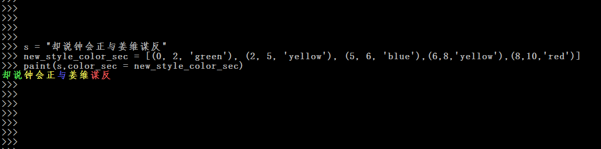
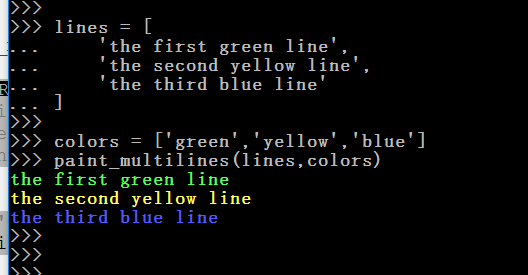
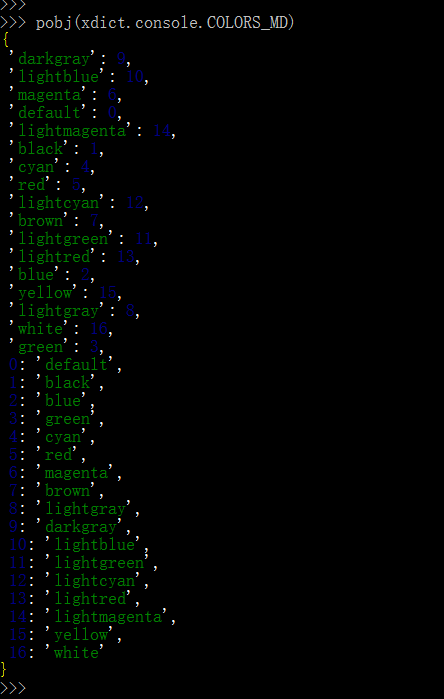

__1. paint(s,**kwargs)__
-------------------------

    from xdict.console import *
    from xdict.jprint import pobj
    
    # new_style_color_sec is a tuple_list
    # [tuple,tuple,tuple.......]
    # each tuple with the below format (start_index,end_index,foreground_color)
    s = "却说钟会正与姜维谋反"
    new_style_color_sec = [(0, 2, 'green'), (2, 5, 'yellow'), (5, 6, 'blue'),(6,8,'yellow'),(8,10,'red')]
    paint(s,color_sec = new_style_color_sec)
    

    # new_style_color_sec is a list_stlye_dict(ltdict), index start from 1
    # { 1:tuple,2:tuple,3:tuple .......}
    # each tuple with the below format (start_index,end_index,foreground_color)
    # important : end_index is included ! 
    # for example (0,3) means 0 ,1,2,3 !  
    # 3 is included !!
    s = "却说钟会正与姜维谋反"
    old_style_color_sec = {1: (0, 1, 'green'), 2: (2, 4, 'yellow'), 3: (5, 5, 'blue'), 4: (6, 7, 'yellow'), 5: (8, 9, 'red')}
    paint(s,color_sec = old_style_color_sec)

 

__2. paint_singleline(line,color,**kwargs)__
---------------------------------------------

    prefix = '
'
    line = "the colored content"
    suffix = '
'
    paint_singleline(line,'blue',prefix=prefix,suffix=suffix)
    paint_singleline(line,'blue',prefix=prefix,suffix=suffix,prefix_color='green',suffix_color='green')

 

__3. paint_multilines(lines,colors,line_sp='\n')__
--------------------------------------------------

    lines = [
        'the first green line',
        'the second yellow line',
        'the third blue line'
    ]

    colors = ['green','yellow','blue']
    paint_multilines(lines,colors)

 

__4. oldStylize(color_sec)__
-----------------------------

    new_style_color_sec = [(0, 2, 'green'), (2, 5, 'yellow'), (5, 6, 'blue'),(6,8,'yellow'),(8,10,'red')]
    old_style_color_sec = oldStylize(new_style_color_sec)
    pobj(old_style_color_sec,fixed_indent=True)

 

__5. newStylize(color_sec)__
-----------------------------

    old_style_color_sec = {1: (0, 1, 'green'), 2: (2, 4, 'yellow'), 3: (5, 5, 'blue'), 4: (6, 7, 'yellow'), 5: (8, 9, 'red')}
    new_style_color_sec = newStylize(old_style_color_sec)
    pobj(new_style_color_sec,fixed_indent=True)

 

__6. COLORS_MD__
----------------

    pobj(xdict.console.COLORS_MD)

    #linux COLORS_MD
 

    #windows COLORS_MD
 

__7. standlize_color_sec(color_sec,COLORS_MD)__
-----------------------------------------------

    new_style_color_sec = [(0, 2, 'green'), (2, 5, 'yellow'), (5, 6, 'blue'),(6,8,'yellow'),(8,10,'red')]
    internal_color_sec = standlize_color_sec(new_style_color_sec,COLORS_MD)
    pobj(internal_color_sec,fixed_indent=True)

 

 

__8. ansi_8color_control(**kwargs)__
-------------------------------------

    #only for linux
    #control = '\033[' + str(style)+ ";" +str(fg) +";"+str(bg) +"m"

__9. ansi_256color_control(**kwargs)__
---------------------------------------

    #only for linux
    #control = '\033[38;5;' +str(fg) +"m" + '\033[48;5;' +str(bg) +"m"

__10. paint_str(text,**kwargs)__
-------------------------------

    # just for compatible to old code, use paint instead

__11. print_str(text,**kwargs)__
---------------------------------

    # just for compatible to old code, use paint instead

