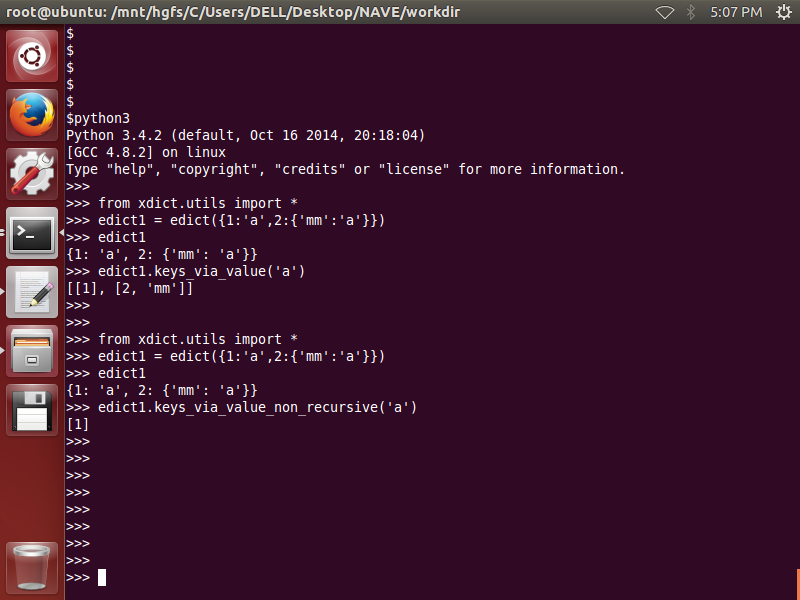
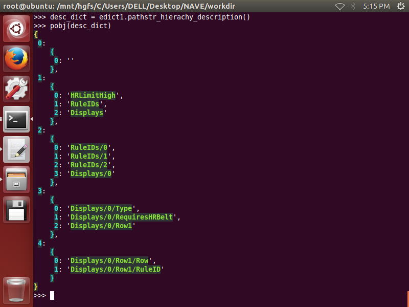
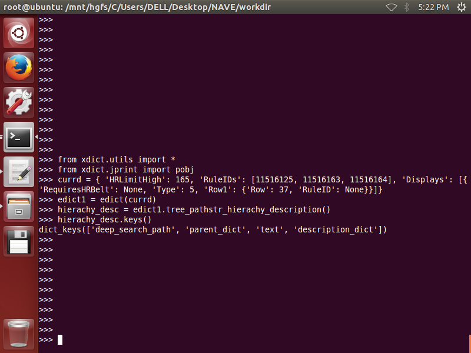
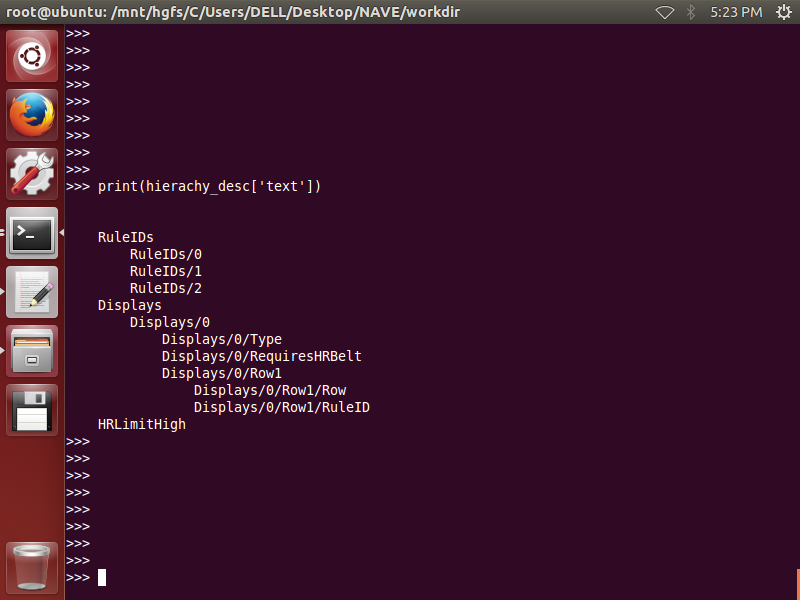
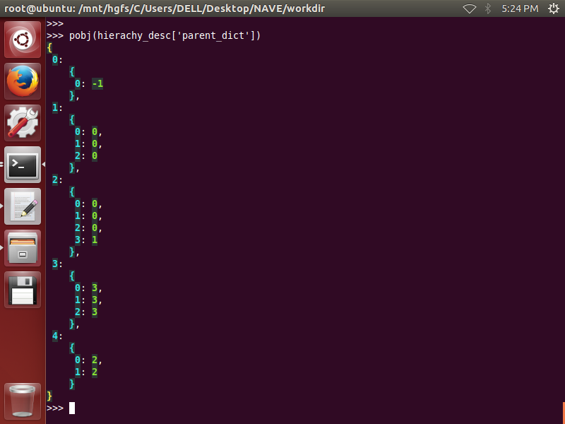
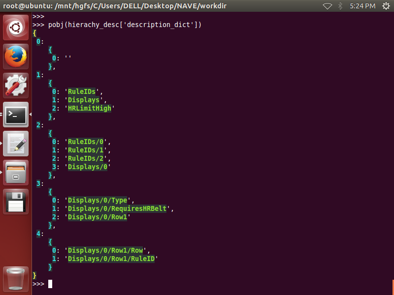

## Part7. [edict](ReadMeDetailed/utils.md)  

__1. .setdefault_via_pathlist(path_list,**kwargs)__  
---------------------------------------------------  

	edict1 = edict({})
	edict1
	path_list = ['c','b']
	edict1.setdefault_via_pathlist(path_list)
	edict1

__2. .setitem_via_pathlist(pathlist,value,**kwargs)__
-----------------------------------------------------

        edict1 = edict({})
        edict1
        
        path_list = ['c','b']
        edict1.setitem_via_pathlist(path_list,'i am ok')
        edict1
        
        
        path_list = ['c']
        edict1.setitem_via_pathlist(path_list,{})
        edict1
        
        path_list = ['c','b']
        edict1.setitem_via_pathlist(path_list,'i am ok')
        edict1

  

__3. .getitem_via_pathlist(pathlist,**kwargs)__
-----------------------------------------------

	edict1 = edict({'c':{'b':'x'})
	edict1

	path_list = ['c','b']
	edict1.getitem_via_pathlist(path_list)
	
  

__4. .getitem_via_cmd(cmd,**kwargs)__
-------------------------------------

	edict1 = edict({'c':{'b':'x'})
	edict1

	cmd = 'c b'
	edict1.getitem_via_cmd(cmd)
	

__5. .getitem_via_pathstr(pathstr,**kwargs)__
---------------------------------------------

	edict1 = edict({'c':{'b':'x'})
	edict1

	pathstr = 'c/b'
	edict1.getitem_via_pathstr(pathstr)
	

__6. .delitem_via_pathlist(pathlist,**kwargs)__
-----------------------------------------------

	edict1 = edict({'c':{'b':'x'}})
	edict1

	pathlist = ['c','b']
	edict1.delitem_via_pathlist(pathlist)
	

__7. .sons_pathstrs(parent_pathstr,**kwargs)__
----------------------------------------------

        edict1 = edict({1:'a',2:{'x':'b'}})
        edict1
        
        edict1.sons_pathstrs('')
        edict1.sons_pathstrs('2')
        edict1.sons_pathstrs('2/x')
        

__8. .include_pathlist(spathlist,**kwargs)__
--------------------------------------------

        edict1 = edict({1:'a',2:{'x':'b'}})
        edict1
            
        pathlist = [2,'x']
        edict1.include_pathlist(pathlist)
        

        
	
__9. .keys_via_value(value)__
-----------------------------

        from xdict.utils import *
        edict1 = edict({1:'a',2:{'mm':'a'}})
        edict1
        edict1.keys_via_value('a')

__10. .keys_via_value_non_recursive(value)__
--------------------------------------------

        from xdict.utils import *
        edict1 = edict({1:'a',2:{'mm':'a'}})
        edict1
        edict1.keys_via_value_non_recursive('a')
        
        

 
 
__11. .pathstr_hierachy_description(**kwargs)__
----------------------------------------------------

        from xdict.utils import *
        from xdict.jprint import pobj
        currd = { 'HRLimitHigh': 165, 'RuleIDs': [11516125, 11516163, 11516164], 'Displays': [{'RequiresHRBelt': None, 'Type': 5, 'Row1': {'Row': 37, 'RuleID': None}}]}
        edict1 = edict(currd)
        desc_dict = edict1.pathstr_hierachy_description()
        pobj(desc_dict)

 
 
 __12. .tree_pathstr_hierachy_description(**kwargs)__
----------------------------------------------------

        from xdict.utils import *
        from xdict.jprint import pobj
        currd = { 'HRLimitHigh': 165, 'RuleIDs': [11516125, 11516163, 11516164], 'Displays': [{'RequiresHRBelt': None, 'Type': 5, 'Row1': {'Row': 37, 'RuleID': None}}]}
        edict1 = edict(currd)
        hierachy_desc = edict1.tree_pathstr_hierachy_description()
        hierachy_desc.keys()
        print(hierachy_desc['text'])
        pobj(hierachy_desc['parent_dict'])
        pobj(hierachy_desc['description_dict'])
        

 
 
__13. .update_just_intersection(dict2)__
----------------------------------------

        from xdict.utils import *
        from xdict.jprint import pobj
        edict1 = edict({1:'a',2:'b',3:'c',4:'d'})
        edict2 = edict({5:'u',2:'v',3:'w',6:'x',7:'y'})
        edict1.update_just_intersection(edict2)
        pobj(edict1)
        pobj(edict2)

        
        
__14. .uniqualize()__
---------------------

        from xdict.utils import *
        from xdict.jprint import pobj
        edict1 = edict({1:'a',2:'b',3:'c',4:'b'})
        edict1.uniqualize()
        pobj(edict1)

        
__15. .xextend(dict2)__
-----------------------  

        from xdict.utils import *
        from xdict.jprint import pobj
        edict1 = edict({1:'a',2:'b',3:'c',4:'d'})
        edict2 = edict({5:'u',2:'v',3:'w',6:'x',7:'y'})
        pobj(edict1.xextend(edict2))
        pobj(edict1)
        
        edict1 = edict({1:'a',2:'b',3:'c',4:'d'})
        edict2 = edict({5:'u',2:'v',3:'w',6:'x',7:'y'})
        pobj(edict1.xextend(edict2,overwrite=1))
        pobj(edict1)

__16. .comprise(dict2)__
------------------------
        
        from xdict.utils import *
        from xdict.jprint import pobj
        edict1 = edict({'a':1,'b':2,'c':3,'d':4})
        edict2 = edict({'b':2,'c':3})
        edict1.comprise(edict2)

__17. .value_keys_description()__
---------------------------------

        from xdict.utils import *
        from xdict.jprint import pobj
        edict1 = edict({'a':1,'b':2,'c':2,'d':4})
        edict1.value_keys_description()

__18. .tree_pathstr_with_dynamic_indent()__
--------------------------------------------

        from xdict.utils import *
        from xdict.jprint import pobj
        currd = { 'HRLimitHigh': 165, 'RuleIDs': [11516125, 11516163, 11516164], 'Displays': [{'RequiresHRBelt': None, 'Type': 5, 'Row1': {'Row': 37, 'RuleID': None}}]}
        edict1 = edict(currd)
        s = edict1.tree_pathstr_with_dynamic_indent()
        print(s)

__19. .max_wordwidth()__
------------------------

        from xdict.utils import *
        from xdict.jprint import pobj
        currd = {0:'AutoPauseSpeed', 125:'HRLimitLow', 6:'Activity'}
        edict1 = edict(currd)
        edict1.max_wordwidth()

__20. .max_word_displaywidth()__
--------------------------------

        from xdict.utils import *
        from xdict.jprint import pobj
        currd = {0:'你们大家好', 125:'ABCDE', 6:'1234567'}
        edict1 = edict(currd)
        edict1.max_word_displaywidth()
        

-------------------------------------------------------------------------------------------------------------------------------------------
