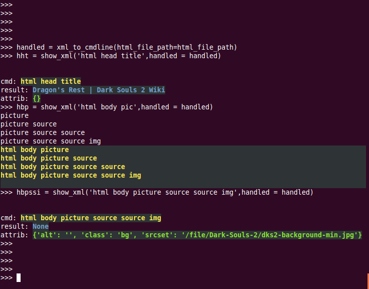

1. format_cmd(cmd,cmd_sp=' ')  
2. path_list_to_cmd(path_list_or_path_string,**kwargs)  
3. cmd_to_path_list(cmd,**kwargs)
4. cmd_to_path_str(cmd,**kwargs)
5. deep_to_cmdlines_ltdict(deep,**kwargs)
6. cmdlines_ltdict_to_deep(cmdlines_ltdict,**kwargs)
7. hdict_to_cmdlines_dict(hdict,**kwargs)
8. ltdict_to_cmdlines(cmdlines_ltdict,**kwargs)
9. cmdlines_to_ltdict(cmdlines,**kwargs)
10. cmdlines_to_deep_ltdict(cmdlines,**kwargs)
11. deep_ltdict_to_cmdlines(deep_ltdict,**kwargs)
12. show_prompt_cmdlines(cmd,cmdlines,**kwargs)
13. get_obj_value_from_cmd(cmd,obj,**kwargs)
14. cmdlines_to_obj(cmdlines,**kwargs)
15. cmdlines_to_xml(cmdlines,**kwargs)  
16. xml_to_cmdline_ltdict(**kwargs)  
17. show_prompt_cmdlines_ltdict(cmd,cmdlines_ltdict,**kwargs)  
18. show_xml(cmd,**kwargs)  
  
19. obj_to_cmdlines_dict(obj)
20. show_obj(cmd,obj,**kwargs)
 
 
21. show_hdict(cmd,hdict,**kwargs)

