1.# __format_cmd_str(cmd_str,cmd_sp=' ')__
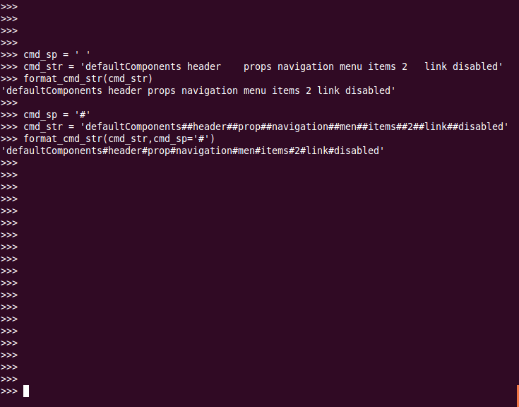  
2. cmd_str_to_cmd_pl(cmd_str,cmd_sp = ' ')
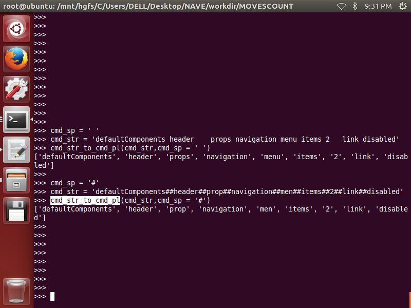
3. path_to_cmd_str(path_list_or_path_string,**kwargs) 
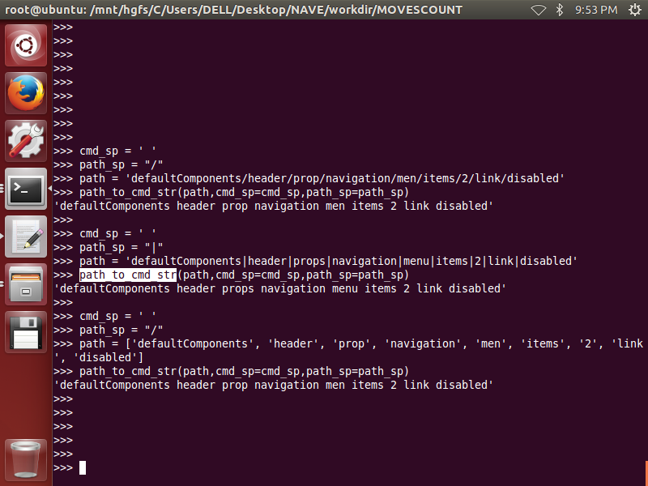
4. cmd_str_to_path_str(cmd,**kwargs)
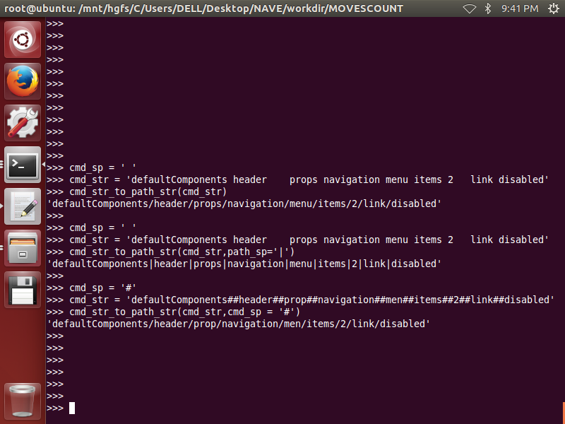
5. get_cmd_char_position_desc(cmdpl,cmd_sp=' ')
6. get_real_si_from_char_position_desc(si,cpdesc)
7. get_real_ei_from_char_position_desc(ei,cpdesc)
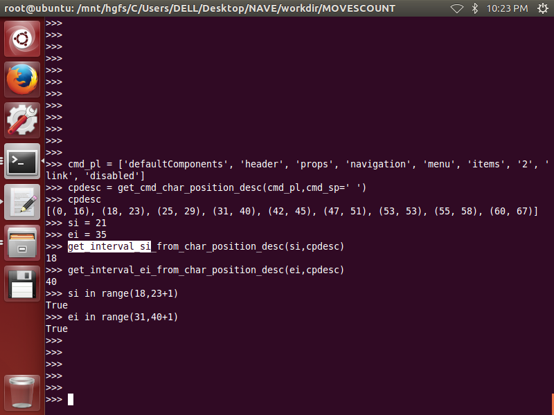
8. cmdpl_in_cmdpl(cmdpl1,cmdpl2,**kwargs)
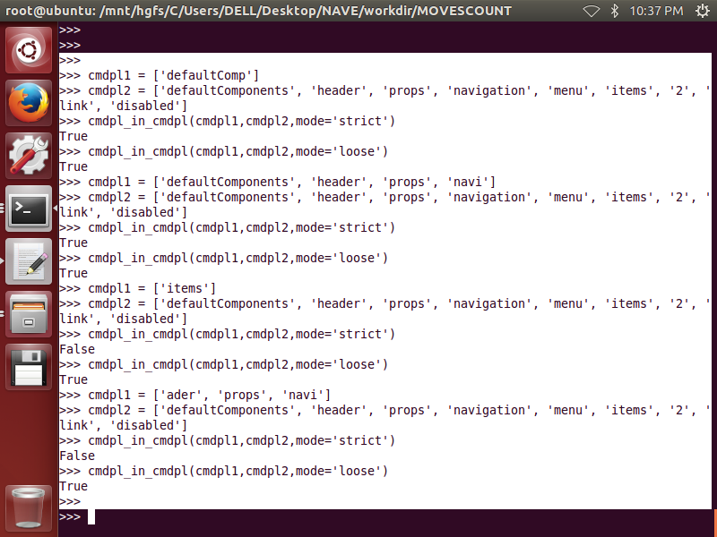
9. cmd_in_cmd(cmd1,cmd2,**kwargs)
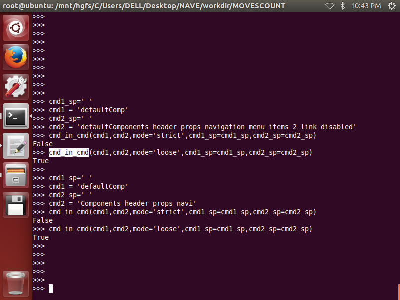
10. cmdlines_str_to_ltdict(cmdlines_str,**kwargs)
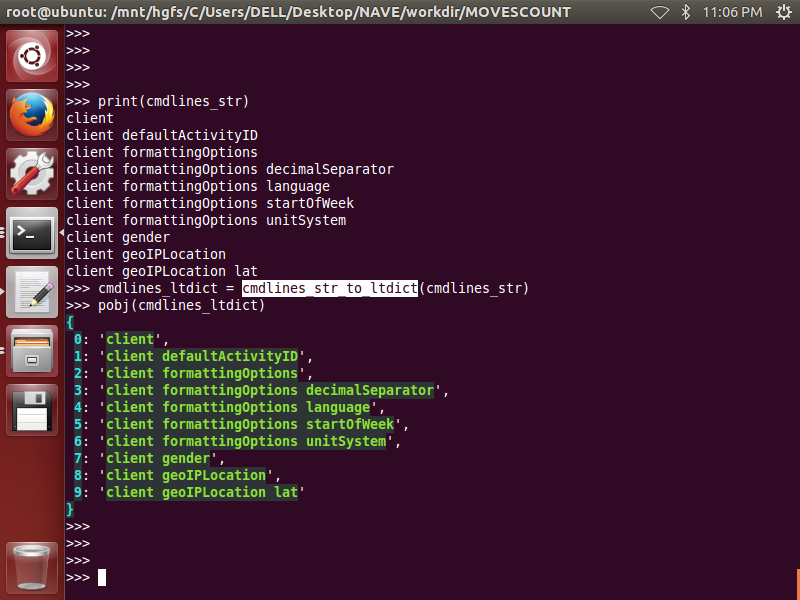
11. cmdlines_ltdict_to_str(cmdlines_ltdict,**kwargs)
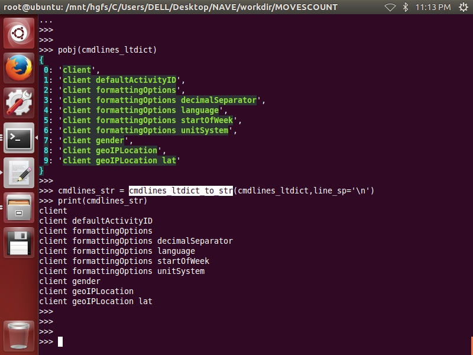
12. cmdlines_ltdict_to_deep(cmdlines_ltdict,**kwargs)
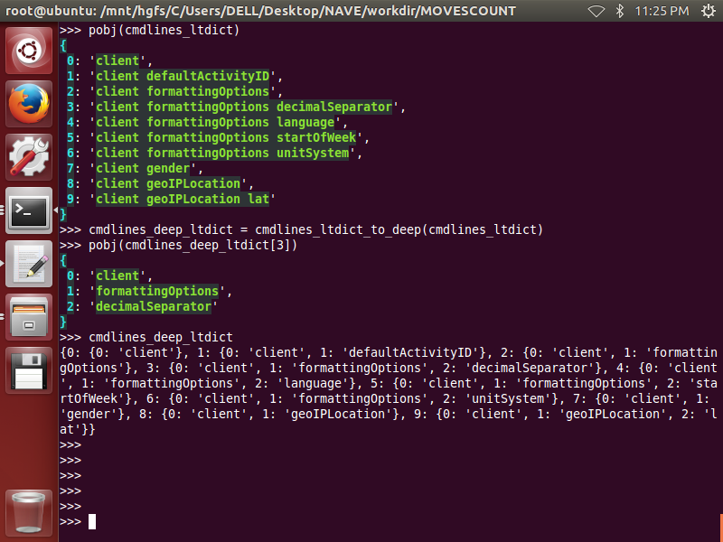
13. cmdlines_deep_to_ltdict(deep,**kwargs)
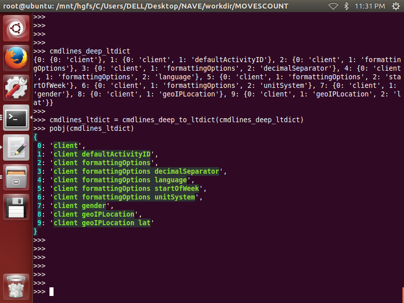
14. cmdlines_str_to_deep(cmdlines_str,**kwargs)
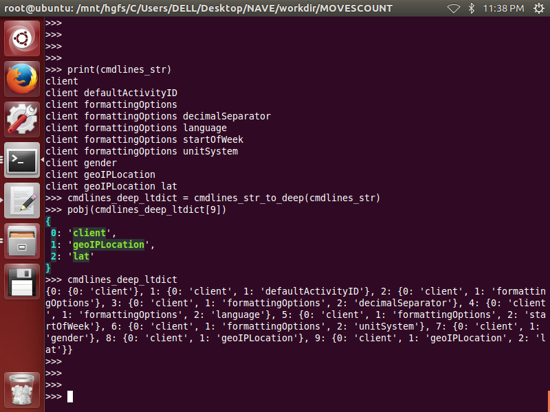
15. cmdlines_deep_to_str(deep_ltdict,**kwargs)
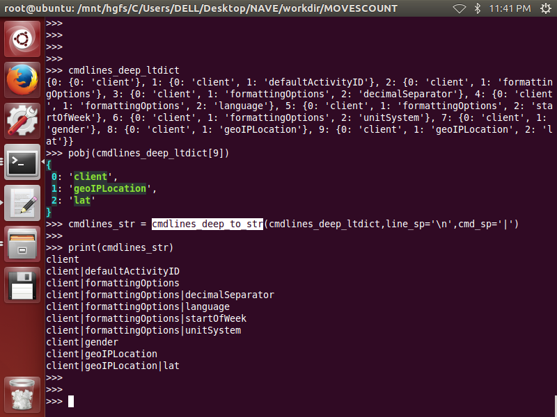
16. show_prompt_from_cmdlines_str(cmd_str,cmdlines_str,**kwargs)
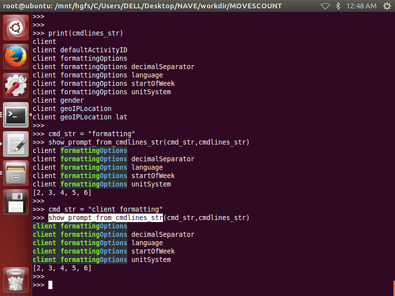
17. show_prompt_from_cmdlines_ltdict(cmd_str,cmdlines_ltdict,**kwargs)
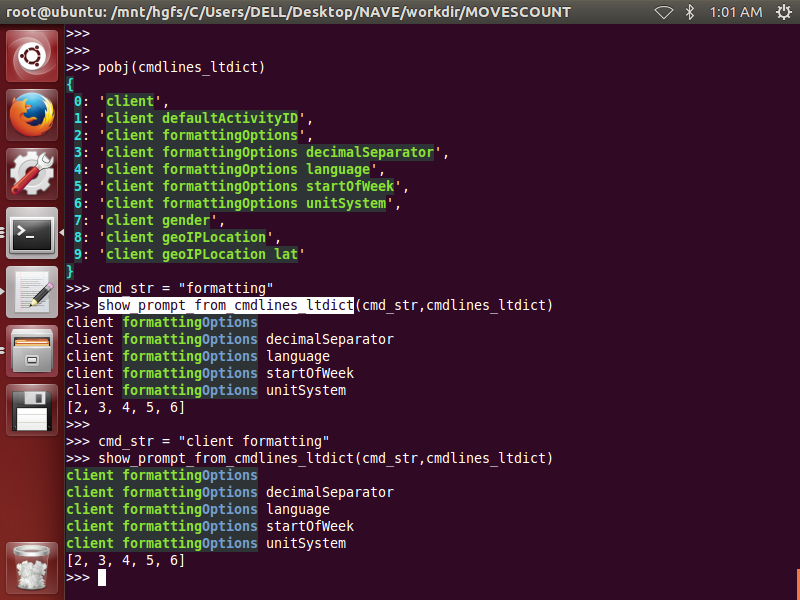
18. hdict_to_cmdlines_full_dict(hdict,**kwargs)
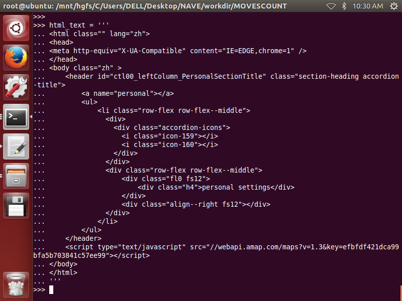 
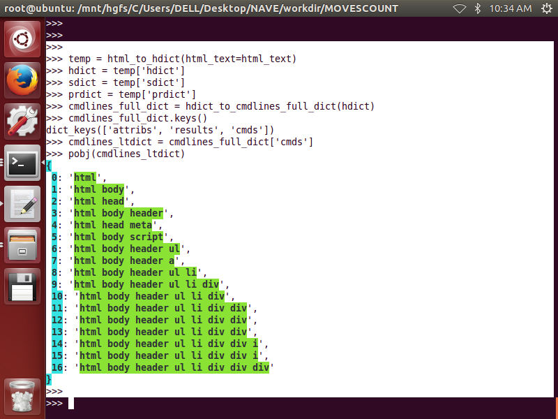
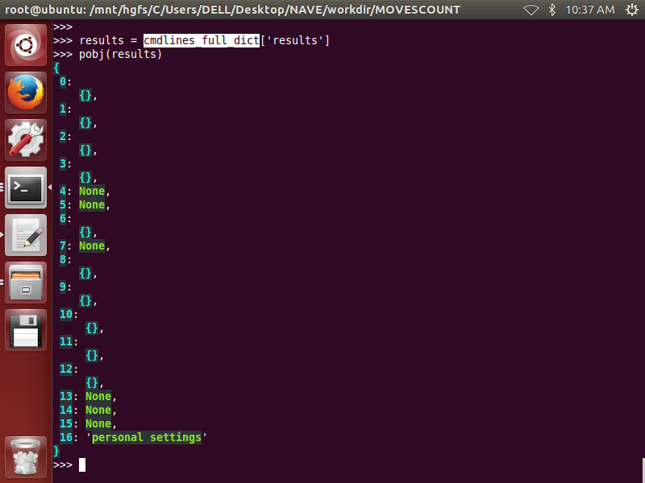
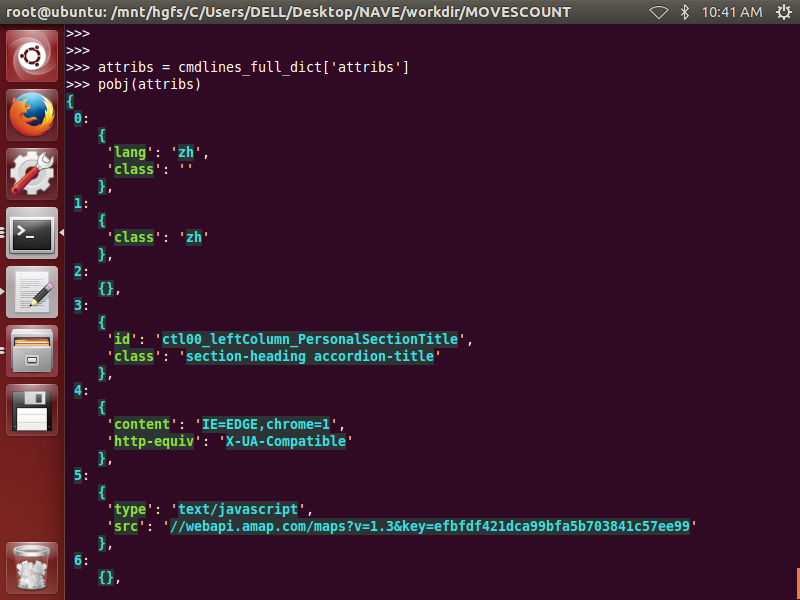
19. obj_to_cmdlines_dict(obj)
20. show_obj(cmd,obj,**kwargs)
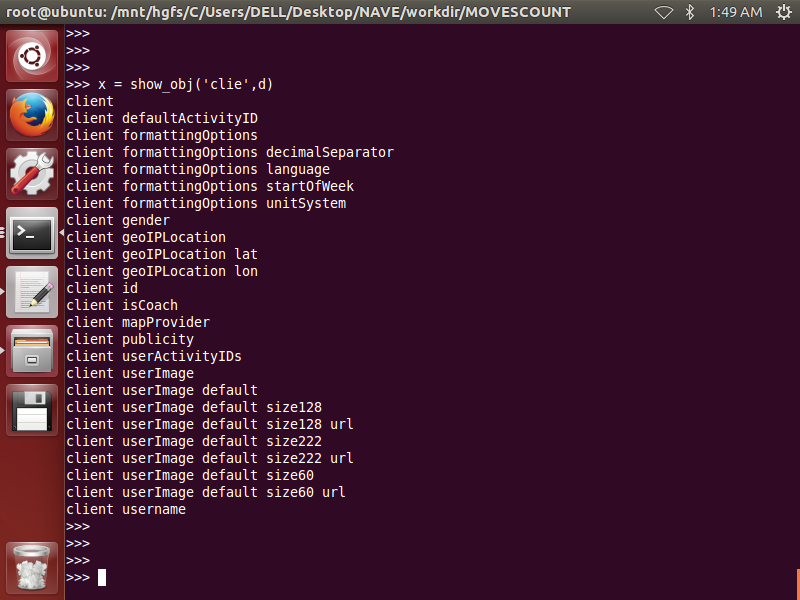 
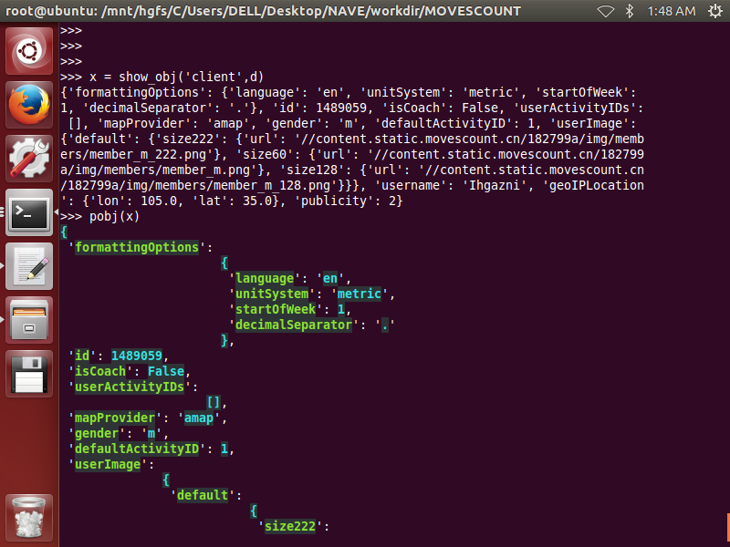 
21. show_hdict(cmd,hdict,**kwargs)
22. cmd_in_cmd(cmd1,cmd2,**kwargs)
23. cmdpl_in_cmdpl(cmdpl1,cmdpl2,**kwargs)

