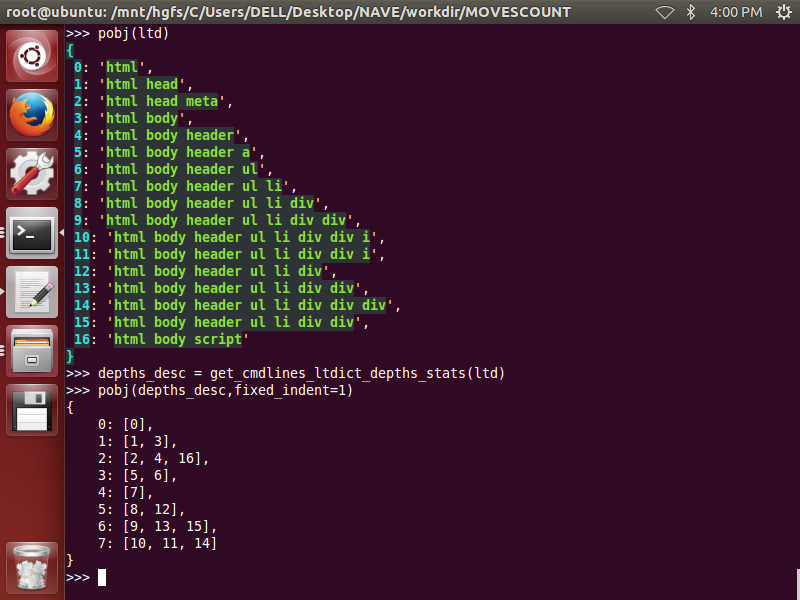

INTRODUCES:
===========
cmd_sp,cmd_str,cmd_pl 
---------------------
>>cmd_sp = ' '  
cmd_str = 'defaultComponents header    props navigation menu items 2   link disabled'  
cmd_sp = '#'  
cmd_str = 'defaultComponents##header##prop##navigation##men##items##2##link##disabled'  
cmd_pl = ['defaultComponents', 'header', 'props', 'navigation', 'menu', 'items', '2', 'link', 'disabled'] 

cmdlines_str,cmdlines_ltdict,cmdlines_deep_ltdict
-------------------------------------------------
>>cmdlines_str  
>>> cmdlines_str = '''client  
... client defaultActivityID  
... client formattingOptions  
... client formattingOptions decimalSeparator  
... client formattingOptions language  
... client formattingOptions startOfWeek  
... client formattingOptions unitSystem  
... client gender  
... client geoIPLocation  
... client geoIPLocation lat'''  

>>cmdlines_ltdict  
>>>{  
 0: 'client',   
 1: 'client defaultActivityID',  
 2: 'client formattingOptions',   
 3: 'client formattingOptions decimalSeparator',   
 4: 'client formattingOptions language',   
 5: 'client formattingOptions startOfWeek',   
 6: 'client formattingOptions unitSystem',   
 7: 'client gender',   
 8: 'client geoIPLocation',   
 9: 'client geoIPLocation lat'  
}  

>>cmdlines_deep_ltdict  
>>>{  
 0: {0: 'client'},   
 1: {0: 'client', 1: 'defaultActivityID'},   
 2: {0: 'client', 1: 'formattingOptions'},   
 3: {0: 'client', 1: 'formattingOptions', 2: 'decimalSeparator'},   
 4: {0: 'client', 1: 'formattingOptions', 2: 'language'},   
 5: {0: 'client', 1: 'formattingOptions', 2: 'startOfWeek'},   
 6: {0: 'client', 1: 'formattingOptions', 2: 'unitSystem'}, 
 7: {0: 'client', 1: 'gender'},   
 8: {0: 'client', 1: 'geoIPLocation'},   
 9: {0: 'client', 1: 'geoIPLocation', 2: 'lat'}  
}  

cmdlines_full_dict
------------------
>>cmdlines_full_dict  
>>>cmdlines_full_dict = {  
    'cmds': {......}  
    'attribs':{......}  
    'results':{......}  
}  

>>cmdlines_full_dict['cmds'])
>>>{  
 0: 'html',   
 1: 'html body',   
 2: 'html head',   
 3: 'html body header',   
 4: 'html head meta',   
 5: 'html body script',   
 6: 'html body header ul',   
 7: 'html body header a',   
 8: 'html body header ul li',   
 9: 'html body header ul li div',   
 10: 'html body header ul li div',   
 11: 'html body header ul li div div',    
 12: 'html body header ul li div div',   
 13: 'html body header ul li div div',   
 14: 'html body header ul li div div i',   
 15: 'html body header ul li div div i',   
 16: 'html body header ul li div div div'  
}  

>>cmdlines_full_dict['results']
>>>{  
    0: {},   
    1: {},   
    2: {},   
    3: {},   
    4: None,   
    5: None,   
    6: {},   
    7: None,   
    8: {},   
    9: {},   
    10: {},   
    11: {},   
    12: {},   
    13: None,   
    14: None,   
    15: None,   
    16: 'personal settings'  
}  

>>cmdlines_full_dict['attribs']  
>>>{  
    0: {'lang': 'zh', 'class': ''},   
    1: {'class': 'zh'},   
    2: {},   
    3: {'id': 'ctl00_leftColumn_PersonalSectionTitle', 'class': 'section-heading accordion-title'},   
    4: {'content': 'IE=EDGE,chrome=1', 'http-equiv': 'X-UA-Compatible'},   
    5: {'type': 'text/javascript', 'src': '//webapi.amap.com/maps?v=1.3&key=efbfdf421dca99bfa5b703841c57ee99'},   
    6: {},   
    7: {'name': 'personal'},   
    8: {'class': 'row-flex row-flex--middle'},   
    9: {},   
    10: {'class': 'row-flex row-flex--middle'},   
    11: {'class': 'accordion-icons'},   
    12: {'class': 'fl0 fs12'},   
    13: {'class': 'align--right fs12'},   
    14: {'class': 'icon-160'},   
    15: {'class': 'icon-159'},   
    16: {'class': 'h4'}  
}  

FUNCTIONS:
==========
# 1. __format_cmd_str(cmd_str,cmd_sp=' ')__
  
# 2. __cmd_str_to_cmd_pl(cmd_str,cmd_sp = ' ')__

# 3. __path_to_cmd_str(path_list_or_path_string,**kwargs)__ 

# 4. __cmd_str_to_path_str(cmd,**kwargs)__

# 5. __get_cmd_char_position_desc(cmdpl,cmd_sp=' ')__
# 6. __get_real_si_from_char_position_desc(si,cpdesc)__
# 7. __get_real_ei_from_char_position_desc(ei,cpdesc)__

# 8. __cmdpl_in_cmdpl(cmdpl1,cmdpl2,**kwargs)__

# 9. __cmd_in_cmd(cmd1,cmd2,**kwargs)__

# 10. __cmdlines_str_to_ltdict(cmdlines_str,**kwargs)__

# 11. __cmdlines_ltdict_to_str(cmdlines_ltdict,**kwargs)__

# 12. __cmdlines_ltdict_to_deep(cmdlines_ltdict,**kwargs)__

# 13. __cmdlines_deep_to_ltdict(deep,**kwargs)__

# 14. __cmdlines_str_to_deep(cmdlines_str,**kwargs)__

# 15. __cmdlines_deep_to_str(deep_ltdict,**kwargs)__

# 16. __show_prompt_from_cmdlines_str(cmd_str,cmdlines_str,**kwargs)__

# 17. __show_prompt_from_cmdlines_ltdict(cmd_str,cmdlines_ltdict,**kwargs)__

# 18. __hdict_to_cmdlines_full_dict(hdict,**kwargs)__
 

# 19. __get_cmdlines_ltdict_open_close_structute(cmdlines_ltdict,stagns,etagns)__
 

# 20. __get_tags_info_from_cmdlines_ltdict(cmdlines_ltdict)__
 

# 21. __update_tags_info_with_results(stagns,etagns,results)__
 

 
 
 
 
 
# 22. __get_html_lines_from_cmdlines_ltdict_and_tags_info(cmds,stagns,etagns,results,attribs,**kwargs)__
 

 
 
 
 
# 23. __cmdlines_full_dict_to_html_text(cmdlines_full_dict,**kwargs)__
 
 
 
 
# 24. __cmdlines_full_dict_to_hdict(cmdlines_full_dict,**kwargs)__
# 25. __get_obj_value_via_cmd(cmd,obj,**kwargs)__
 
# 26. __get_cmdlines_ltdict_duplines_stats(cmdlines_ltdict)__
 
 
# 27. __get_cmdlines_ltdict_leaf_stats(cmdlines_ltdict,**kwargs)__
 
  
# 28. __get_cmdlines_ltdict_parent_stats(cmdlines_ltdict,**kwargs)__
 

# 29. __get_cmdlines_ltdict_son_stats(cmdlines_ltdict,**kwargs)__
 

# 30. __get_cmdlines_ltdict_hierarchy_stats(cmdlines_ltdict,**kwargs)__

# 31. __get_cmdlines_ltdict_breadth_stats(cmdlines_ltdict,**kwargs)__

# 32. __get_cmdlines_ltdict_ancestors_stats(cmdlines_ltdict,**kwargs)__
 

# 33. __get_cmdlines_ltdict_descedants_stats(cmdlines_ltdict,**kwargs)__
 

# 34. __get_cmdlines_ltdict_roots_stats(cmdlines_ltdict,**kwargs)__
 
# 35. __get_cmdlines_ltdict_siblings_stats(cmdlines_ltdict,**kwargs)__
 
 
 
# 36. __get_cmdlines_ltdict_depths_stats(cmdlines_ltdict,**kwargs)__
 
# 37. __undup_cmdlines_ltdict(cmdlines_ltdict,**kwargs)__
 

# 38. __cmdlines_str_to_obj(cmdlines_str,**kwargs)__
 

# 39. __cmdlines_str_to_html_text(cmdlines_str,**kwargs)__
 

# 40. __html_text_to_cmdlines_full_dict(**kwargs)__
 

# 41. __show_html_text_via_cmd(cmd,**kwargs)__
 

# 42. __obj_to_cmdlines_full_dict(obj)__
 

# 43. __show_obj_via_cmd(cmd,obj,**kwargs)__

# 44. __show_hdict_via_cmd(cmd,hdict,**kwargs)__

