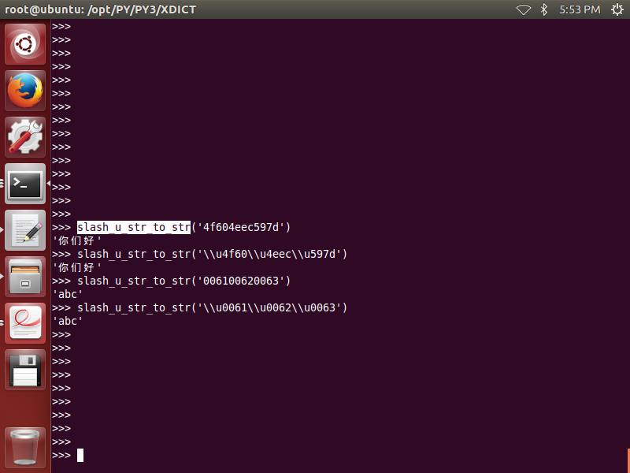
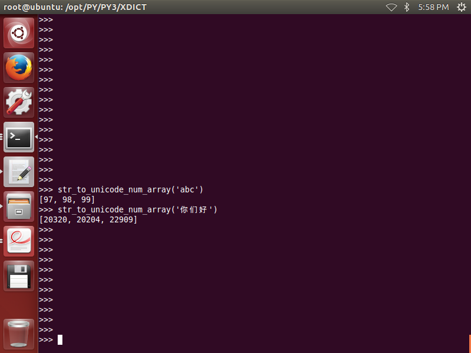

##object type judgement
1. is_list(obj):  
2. is_tuple(obj):  
3. is_dict(obj):
4. is_set(obj):
5. is_str(obj):
6. is_int(obj):
7. is_float(obj):
8. is_number(obj):
9. is_bool(obj):
10. is_none(obj):
11. is_recursive_type(obj):
12. is_module(obj):
13. is_non_buildin_function(obj):
14. is_buildin_function(obj):
15. is_function(obj):
16. is_type(obj):
17. is_customer_defined_type(obj):
18. is_hashable_type(obj):
19. is_unhashable_type(obj):
20. is_json(obj,strict=False):
21. get_type_name(obj):

##path string
1. is_slash_end(path_string,delimiter='/')  
2. get_dir_string_head(path_string,delimiter='/')  
3. get_dir_string_tail(self,path_string,delimiter='/')  
4. path_str_to_path_list(path_str,sp="/",keep_head_sp=0,keep_end_sp=0)
5. path_list_to_path_str(path_list,sp="/",keep_head_sp=0,keep_end_sp=0)

##string
1. loose_str_to_bool(str)  
2. str_lstrip(s,char,count)  
3. str_rstrip(s,char,count)  
4. str_prepend(s,char,count)
5. str_append(s,char,count)  
6. is_number_str(obj)

##dict list tuple
1. creat_default_list_with_len(len,element=None)  
2. set_default_dict_items_via_path_list(external_dict,path_list,n2s=0,s2n=0)  
3. path_list_in_dict(external_dict,path_list,n2s=0,s2n=0)  
4. set_dict_items_via_path_list(external_dict,path_list,value,n2s=0,s2n=0)  
5. get_dict_items_via_path_list(external_dict,path_list,n2s=0,s2n=0)  
6. get_dict_value_from_full_key_path(d,full_key_path)  
7. get_all_sons_full_key_path_list(d,full_key_path)  

## char encode decode  
1. unpack_unicode_char_bytes(two_bytes)  
  

2. pack_unicode_char_str(char_str)  
  

3. unpack_unicode_bytes_stream(Bs)  
  

4. pack_unicode_str(str)  
 

5. char_to_slash_u_str(ch,with_slash_u=1)  
 

6. slash_u_str_to_char(slash_u_str)  
 

7. str_to_slash_u_str(a_string,with_slash_u=1)  

8. slash_u_str_to_str(slash_us)  

9. char_str_to_unicode_num(char_str)  

10. unicode_num_to_char_str(unicode_num)  

11. str_to_unicode_num_array(a_string)  

12. unicode_num_array_to_str(num_arr)  

